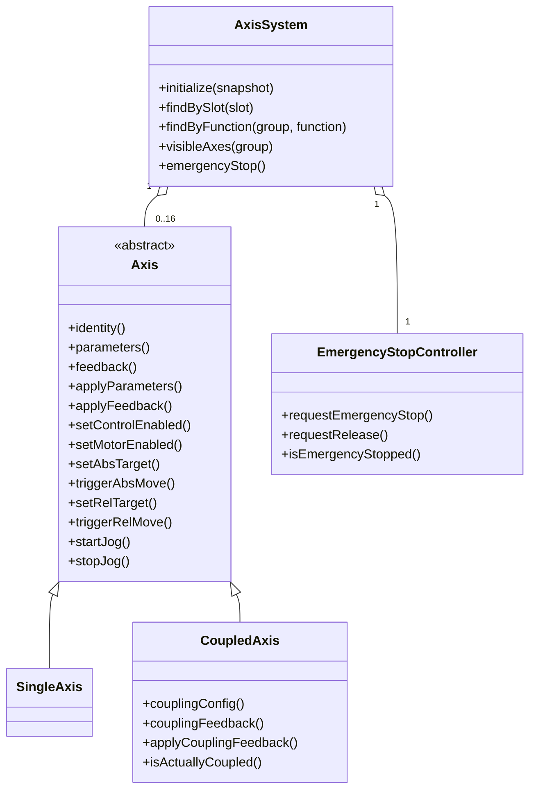
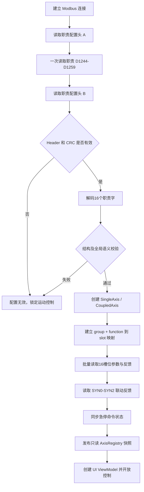

# PLC 16 槽位动态轴领域模型与职责配置协议

> 文档状态：设计确认稿  
> 日期：2026-08-03  
> 适用工程：`PLC_re`、`servoV6`  
> 目标：基于当前 PLC 的 16 槽位轴控模型，定义上位机领域模型、职责配置协议、启动同步流程及迁移边界。

## 1. 已确认的设计决策

本文以以下结论作为后续设计前提：

1. PLC 后续会补充“报警解除触发”的实际复位逻辑，上位机保留对应领域接口和协议命令。
2. 系统急停暂不增加独立反馈寄存器。上位机将 PLC 的“设备急停”命令位为 ON 视为设备已经进入急停状态。
3. `职责[0..15]` 只作为上位机启动配置来源，不参与 PLC 实时运动控制，也不作为运动、联动或急停的运行时反馈。
4. PLC 的实时位置、运动状态、限位状态、告警码及联动状态始终是上位机运行时状态的最终真相源。
5. 上位机从固定的 X/X1/X2/Y/Z/R 六轴模型迁移为 16 个 PLC 槽位的动态轴注册模型。

## 2. 设计目标与非目标

### 2.1 设计目标

- 完整覆盖 PLC 单轴提供的全部设置参数、控制命令和状态反馈。
- 支持 L0-L9、C0-C2、SYN0-SYN2 共 16 个 PLC 轴槽位。
- 根据职责配置动态建立 A/B 分组及 X、X1、X2、Y、Z、R 功能轴映射。
- 普通轴和联动轴向上层暴露统一的单轴操作接口。
- 联动轴在统一单轴能力之外，保存主轴、从轴、联动配置和 PLC 实际联动反馈。
- UI 根据动态配置创建轴页面，不再依赖固定 `AxisId` 枚举。
- 明确职责配置的结构校验、语义校验、完整性校验和异常降级策略。

### 2.2 非目标

- `职责`不负责驱动 PLC 建立联动关系。
- `职责`不替代 `联动轴信息`等 PLC 运行时结构。
- CRC 不用于证明业务配置正确，也不用于防止恶意篡改。
- 本阶段不改变 PLC 关于“设备急停 ON 即视为已经急停”的约定。
- 本文不直接规定 QML 页面的视觉样式，只规定 UI 所需的数据模型和映射来源。

## 3. 当前 PLC 轴槽位模型

### 3.1 PLC 槽位与运动轴映射

PLC 内部所有单轴数组统一使用 0-15 的槽位下标：

| PLC 槽位 | PLC 运动轴 | 类型 |
|:--:|:-:|---|
| 0 | L0 | 直线轴 |
| 1 | L1 | 直线轴 |
| 2 | L2 | 直线轴 |
| 3 | L3 | 直线轴 |
| 4 | L4 | 直线轴 |
| 5 | L5 | 直线轴 |
| 6 | L6 | 直线轴 |
| 7 | L7 | 直线轴 |
| 8 | L8 | 直线轴 |
| 9 | L9 | 直线轴 |
| 10 | C0 | 旋转轴 |
| 11 | C1 | 旋转轴 |
| 12 | C2 | 旋转轴 |
| 13 | SYN0 | 虚拟联动轴 |
| 14 | SYN1 | 虚拟联动轴 |
| 15 | SYN2 | 虚拟联动轴 |

“实际电机号”由 PLC/EtherCAT 组态决定。上位机只使用 PLC 槽位号，不在领域模型中重复维护 EtherCAT 电机编号。

### 3.2 当前寄存器布局

PLC 的主要数组采用规则地址布局。Float32 每项占两个 D 字，整数/位域每项占一个 D 字。

#### 设置参数和控制量

| PLC 变量 | 基地址 | 单项类型 | 槽位地址 |
|---|---:|---|---|
| 手动速度 | D0 | Float32 | `D0 + slot * 2` |
| 定位速度 | D32 | Float32 | `D32 + slot * 2` |
| 使能轴控 | M0 | Bool | `M0 + slot` |
| 相对原点清除 | M16 | Bool/触发 | `M16 + slot` |
| 绝对位置清零 | M32 | Bool/触发 | `M32 + slot` |
| 绝对定位触发 | M48 | Bool/触发 | `M48 + slot` |
| 相对定位触发 | M64 | Bool/触发 | `M64 + slot` |
| 点动正转 | M80 | Bool/电平 | `M80 + slot` |
| 点动反转 | M96 | Bool/电平 | `M96 + slot` |
| 报警解除触发 | M112 | Bool/触发 | `M112 + slot` |
| 使能电机 | M128 | Bool/电平 | `M128 + slot` |
| 相对定位终止触发 | M144 | Bool/触发 | `M144 + slot` |
| 绝对定位终止触发 | M160 | Bool/触发 | `M160 + slot` |
| 相对原点设置 | M176 | Bool/触发 | `M176 + slot` |
| 点动心跳 | M192 | Bool/周期脉冲 | `M192 + slot` |
| 告警码置零 | M208 | Bool/触发 | `M208 + slot` |
| 设备急停 | M224 | Bool | 系统级 |
| 设备急停解除 | M225 | Bool/触发 | 系统级 |
| 相对原点记录 | D1064 | Float32 | `D1064 + slot * 2` |
| 绝对定位距离 | D1096 | Float32 | `D1096 + slot * 2` |
| 相对定位距离 | D1128 | Float32 | `D1128 + slot * 2` |
| 软件负限位 | D1160 | Float32 | `D1160 + slot * 2` |
| 软件正限位 | D1192 | Float32 | `D1192 + slot * 2` |
| 超差阈值 | D1224 | 3 项数组 | `D1224 + synIndex`，具体类型以 PLC 导出类型为准 |
| 软限位控制 | D1228 | UInt16 位域 | `D1228 + slot` |
| 职责 | D1244 | UInt16 位域 | `D1244 + slot` |

#### 状态反馈

| PLC 变量 | 基地址 | 单项类型 | 槽位地址 |
|---|---:|---|---|
| 绝对位置 | D64 | Float32 | `D64 + slot * 2` |
| 相对位置 | D96 | Float32 | `D96 + slot * 2` |
| 运动状态 | D128 | UInt16 | `D128 + slot` |
| 限位状态 | D144 | UInt16 | `D144 + slot` |
| 告警码 | D160 | UInt16 位域 | `D160 + slot` |
| 联动轴信息 | D1300 | 3 项结构体数组 | 对应 SYN0-SYN2 |

### 3.3 “职责”实际宽度

当前 `职责[0..15]` 从 D1244 连续占用到 D1259，D1260 已经是 `联动成员信息`。因此每个职责元素实际为一个 16 位 D 字，而不是一个 32 位值。

上位机协议类型必须定义为：

```cpp
using RawAxisRole = std::uint16_t;
```

如未来要升级到 32 位，必须同步修改 PLC 类型、D 地址布局、配置版本和上位机解码器，不能只修改上位机类型。

## 4. 职责配置协议

### 4.1 位编号约定

PLC 程序使用 `.0`表示最低位。为避免“bit 1”究竟是最低位还是第二位的歧义，本文统一使用从 0 开始的位编号。

| 位 | 宽度 | 含义 | 备注 |
|---:|---:|---|---|
| 0 | 1 | 分组 | 0=A，1=B |
| 1-3 | 3 | 功能轴 | 0=X，1=X1，2=X2，3=Y，4=Z，5=R；6、7非法 |
| 4 | 1 | UI 展示 | 1=展示，0=不展示 |
| 5-8 | 4 | 主轴槽位 | 0-15；仅 X 联动配置时解析 |
| 9-12 | 4 | 从轴槽位 | 0-15；仅 X 联动配置时解析 |
| 13 | 1 | 联动配置 | 仅说明启动配置期望，不是运行时联动状态 |
| 14 | 1 | 保留 | 必须写 0 |
| 15 | 1 | 配置有效 | 1=该槽位职责有效，0=未配置 |

这与原来采用一基编号的描述等价：原 bit1 对应本文 bit0，原 bit14 对应本文 bit13。

### 4.2 为什么必须增加有效位

没有有效位时，原始值 0 同时可能表示：

- 槽位未配置；
- A 组；
- X 功能轴；
- UI 不展示；
- 未配置联动。

上位机无法区分“空槽位”和合法的 A/X 配置。有效位解决的是结构歧义，CRC 不能替代有效位。

### 4.3 解码结构

```cpp
enum class AxisGroup : std::uint8_t {
    A = 0,
    B = 1
};

enum class AxisFunction : std::uint8_t {
    X  = 0,
    X1 = 1,
    X2 = 2,
    Y  = 3,
    Z  = 4,
    R  = 5
};

struct AxisRoleConfig {
    bool valid = false;
    AxisGroup group = AxisGroup::A;
    AxisFunction function = AxisFunction::X;
    bool visible = false;
    std::uint8_t masterSlot = 0;
    std::uint8_t slaveSlot = 0;
    bool couplingConfigured = false;
};

AxisRoleConfig decodeAxisRole(std::uint16_t raw)
{
    AxisRoleConfig result;
    result.group = static_cast<AxisGroup>((raw >> 0) & 0x01);
    result.function = static_cast<AxisFunction>((raw >> 1) & 0x07);
    result.visible = ((raw >> 4) & 0x01) != 0;
    result.masterSlot = static_cast<std::uint8_t>((raw >> 5) & 0x0F);
    result.slaveSlot = static_cast<std::uint8_t>((raw >> 9) & 0x0F);
    result.couplingConfigured = ((raw >> 13) & 0x01) != 0;
    result.valid = ((raw >> 15) & 0x01) != 0;
    return result;
}
```

禁止使用 C++ 位域结构体直接映射 PLC 字，因为 C++ 位域布局、字节序和编译器实现有关。协议层必须使用掩码和位移显式编解码。

### 4.4 结构校验

每个职责字解码后必须进行以下结构校验：

- bit14 必须为 0。
- `function`必须在 0-5 范围内。
- 分组只能为 A/B。
- 槽位必须在 0-15 范围内。
- `valid == false`时，该槽位不创建领域轴对象，其他位忽略但建议全部写 0。
- 非 X 功能轴必须忽略主轴、从轴和联动位；推荐配置端将这些位写 0。
- `function == X && couplingConfigured == true`时，主轴和从轴必须有效且不同。

### 4.5 全局语义校验

结构合法不代表整组配置合法。读取全部16个职责后，还必须进行跨槽位语义校验：

1. 同一分组内 `(group, function)`必须唯一。
2. 一个 PLC 槽位只能对应一个职责。
3. 联动 X 应位于 SYN0-SYN2，即槽位13-15。
4. 当前 PLC 的 `联动成员信息`只有10项，主轴和从轴当前只允许引用 L0-L9。
5. 主轴与从轴不能指向 X 自己，也不能相互相同。
6. 主轴和从轴引用的槽位必须配置有效。
7. 主轴和从轴应与同组 X1/X2 的职责映射一致。
8. 一个物理槽位不能同时成为两个有效联动轴的成员，除非 PLC 后续明确支持这种关系。
9. `visible`只影响 UI，不影响轴对象是否存在，也不影响轮询和安全管理。
10. A/B 两组允许拥有相同功能名，例如 A/X 和 B/X，但其 PLC 槽位必须不同。

### 4.6 校验失败策略

职责校验失败时不得“猜测”配置，也不得回退到旧的固定 X/Y/Z/R 映射。

推荐策略：

- 整份职责配置标记为 `Invalid`。
- 不开放任何轴运动控制。
- 仍允许读取和展示 PLC 原始诊断信息。
- 日志输出原始职责字、槽位、失败规则和配置版本。
- UI 显示“轴职责配置错误”，要求维护人员修正 PLC 配置后重新同步。
- 急停按钮始终保持可用，不受职责配置是否合法影响。

## 5. CRC 与配置完整性设计

### 5.1 CRC 能解决什么

CRC 可以发现以下偶发问题：

- PLC 保持区存储损坏。
- 配置写入过程中只写入了一部分寄存器。
- 多端配置更新时，上位机读取到了新旧内容混合的快照。
- 地址或字节序错误导致读取的原始职责字发生变化。

CRC 不能发现以下业务错误：

- A 组配置了两个 X1。
- 主轴和从轴填成同一个槽位。
- 将实际 Y 电机错误标记成 Z。
- 配置工具计算 CRC 后，把一份业务含义错误的配置正常写入 PLC。
- 恶意写入者同时修改职责和 CRC。

因此合法性判断必须同时包含：

```text
完整性校验通过
AND 配置版本受支持
AND 单字结构校验通过
AND 全局语义校验通过
```

### 5.2 不建议在每个职责字内加入 CRC

每个职责当前只有16位，业务字段已经使用14位，并需要有效位。把少量 CRC 位塞入每个职责字会产生以下问题：

- 校验强度过低。
- 压缩业务字段，降低未来扩展空间。
- 只能验证单字，不能发现16字配置的部分更新和顺序问题。
- 每个字独立通过 CRC，整组配置仍可能属于两个不同版本。

因此不采用“每个职责字各自带 CRC”的方案。

### 5.3 推荐的整组配置包络

建议 PLC 在独立地址增加一份职责配置头，不占用 `职责[0..15]`内部位：

```cpp
struct AxisRoleConfigHeader {
    std::uint16_t magic;          // 固定值，例如 0x4158（"AX"）
    std::uint16_t schemaVersion;  // 当前为 1
    std::uint16_t roleCount;      // 固定为 16
    std::uint16_t flags;          // 预留，当前为 0
    std::uint32_t generation;     // 每次完整发布配置后递增
    std::uint32_t crc32;          // 整组配置 CRC32
};
```

CRC32 推荐覆盖以下规范化字节流：

```text
schemaVersion (UInt16, big-endian)
roleCount     (UInt16, big-endian)
generation    (UInt32, big-endian)
roles[0]      (UInt16, big-endian)
...
roles[15]     (UInt16, big-endian)
```

算法应固定为一种明确实现，例如 CRC-32/ISO-HDLC，并在 PLC 和 C++ 中使用同一测试向量。不能只写“CRC32”而不规定多项式、初值、反射和最终异或参数。

### 5.4 配置发布顺序

如果职责允许在线修改，推荐配置端采用发布语义：

1. 写入新的 `roles[0..15]`。
2. 写入新版本对应的 CRC32。
3. 最后更新 `generation`，把 generation 更新视为配置提交点。

上位机读取流程：

1. 读取 Header A。
2. 一次 Modbus 请求读取连续的 D1244-D1259。
3. 再次读取 Header B。
4. Header A/B 的 magic、version、generation、CRC 必须一致。
5. 计算 CRC32并比较。
6. 执行结构和语义校验。

如果两次 Header 不一致，说明读取期间配置发生变化，应延迟后重读，不能实例化混合版本。

### 5.5 当前阶段的落地等级

职责决定上位机把哪个 UI 操作发送给哪个 PLC 槽位，映射错误可能导致控制错误电机，因此推荐最终加入整组 CRC32 和 generation。

如果 PLC 当前阶段暂时不增加配置头，最低可接受方案是：

- 增加职责有效位。
- 16个职责字使用一次连续 Modbus 请求读取。
- 执行完整结构和全局语义校验。
- 保存并记录16字配置的上位机哈希指纹。
- 运行期间定期低频复读；发现职责变化后立即锁定运动控制并重新初始化，禁止热替换领域对象。

CRC 配置头属于推荐增强项，不应阻塞第一阶段领域模型重构。

## 6. 上位机领域模型

### 6.1 领域对象关系



### 6.2 轴身份

```cpp
using PlcAxisSlot = std::uint8_t;

enum class PlcAxisKind : std::uint8_t {
    Linear,
    Circular,
    SynchronousVirtual
};

struct AxisIdentity {
    PlcAxisSlot slot;          // PLC 数组下标，领域内稳定主键
    PlcAxisKind plcKind;       // 由 slot 推导
    AxisGroup group;           // 来自职责
    AxisFunction function;     // 来自职责
    bool visible;              // 来自职责
};
```

`slot`是驱动寻址主键；`(group, function)`是业务/UI 查找键。二者不能混为一个枚举。

### 6.3 单轴参数快照

```cpp
struct SoftLimitControl {
    bool positiveEnabled = false;  // PLC bit0
    bool negativeEnabled = false;  // PLC bit1
};

struct AxisParameters {
    float jogSpeed = 0.0F;
    float positioningSpeed = 0.0F;

    bool controlEnabled = false;   // 使能轴控
    bool motorEnabled = false;     // 使能电机

    float relativeZeroRecord = 0.0F;
    float absoluteTarget = 0.0F;
    float relativeTarget = 0.0F;

    float negativeSoftLimit = 0.0F;
    float positiveSoftLimit = 0.0F;
    SoftLimitControl softLimitControl;
};
```

`使能轴控`和`使能电机`语义不同，必须保留为两个独立字段和两个独立命令，不能继续合并为旧的 `EnableCommand`。

### 6.4 单轴反馈快照

```cpp
enum class MotionState : std::uint16_t {
    ControlDisabled = 0,
    Idle = 1,
    JogForward = 2,
    JogBackward = 3,
    MovingAbsolute = 4,
    MovingRelative = 5
};

enum class LimitState : std::uint16_t {
    None = 0,
    PositiveSoftware = 1,
    NegativeSoftware = 2,
    PositiveHardware = 3,
    NegativeHardware = 4
};

struct AxisFeedback {
    float absolutePosition = 0.0F;
    float relativePosition = 0.0F;
    MotionState motionState = MotionState::ControlDisabled;
    LimitState limitState = LimitState::None;
    std::uint16_t alarmBits = 0;
};
```

新 PLC 已直接提供运动状态和限位状态，上位机不再通过旧 Coil 组合推导，也不再用 `alarmCode == 3`配合位置值猜测限位方向。

告警码是位集合，不是互斥枚举。领域层应保留原始 `uint16_t alarmBits`，并提供按位查询函数。

### 6.5 抽象基类

```cpp
class Axis {
public:
    explicit Axis(AxisIdentity identity);
    virtual ~Axis() = default;

    const AxisIdentity& identity() const noexcept;
    const AxisParameters& parameters() const noexcept;
    const AxisFeedback& feedback() const noexcept;

    virtual CommandResult setControlEnabled(bool enabled);
    virtual CommandResult setMotorEnabled(bool enabled);

    virtual CommandResult setJogSpeed(float speed);
    virtual CommandResult setPositioningSpeed(float speed);

    virtual CommandResult startJog(Direction direction);
    virtual CommandResult stopJog(Direction direction);

    // 绝对定位：目标值写入和运动触发是两个独立接口
    virtual CommandResult setAbsTarget(float position);
    virtual CommandResult triggerAbsMove();

    // 相对定位：移动距离写入和运动触发是两个独立接口
    virtual CommandResult setRelTarget(float distance);
    virtual CommandResult triggerRelMove();

    virtual CommandResult stopAbsoluteMove();
    virtual CommandResult stopRelativeMove();

    virtual CommandResult setRelativeZero();
    virtual CommandResult clearRelativeZero();
    virtual CommandResult zeroAbsolutePosition();

    virtual CommandResult resetServoAlarm();
    virtual CommandResult clearSoftwareAlarmCode();

    virtual CommandResult setSoftLimits(float negative, float positive);
    virtual CommandResult setSoftLimitControl(SoftLimitControl control);

    virtual void applyParameters(const AxisParameters& parameters);
    virtual void applyFeedback(const AxisFeedback& feedback);

protected:
    AxisIdentity m_identity;
    AxisParameters m_parameters;
    AxisFeedback m_feedback;
};
```

基类不提供把目标设置和运动触发封装在一起的合并定位接口。原因是 PLC 对一次定位明确采用“数据寄存器 + 触发寄存器”两步协议：

```text
绝对定位：写 D1096 + slot*2 -> 触发 M48 + slot
相对定位：写 D1128 + slot*2 -> 触发 M64 + slot
```

上位机领域接口应如实表达这两个独立动作，不能在 `Axis` 中重新合并为一个运动接口。调用方需要先设置目标值/距离，确认命令已被通讯层接受，再调用对应触发接口。

领域接口保留 `resetServoAlarm()`。在 PLC 复位逻辑补充完成前，真实驱动可以返回 `UnsupportedByPlcVersion`，FakePLC 和领域单元测试仍可提前覆盖接口语义。

### 6.6 普通轴

```cpp
class SingleAxis final : public Axis {
public:
    using Axis::Axis;
};
```

普通轴使用基类提供的全部单轴行为，不增加联动数据。

### 6.7 联动轴

```cpp
struct CouplingConfig {
    PlcAxisSlot masterSlot = 0;
    PlcAxisSlot slaveSlot = 0;
    bool configuredEnabled = false;
};

struct CouplingFeedback {
    PlcAxisSlot masterSlot = 15;
    PlcAxisSlot slaveSlot = 15;
    bool couplingValid = false;
};

class CoupledAxis final : public Axis {
public:
    CoupledAxis(AxisIdentity identity, CouplingConfig config);

    const CouplingConfig& couplingConfig() const noexcept;
    const CouplingFeedback& couplingFeedback() const noexcept;

    bool isActuallyCoupled() const noexcept;
    void applyCouplingFeedback(const CouplingFeedback& feedback);

private:
    CouplingConfig m_couplingConfig;      // 来自职责，仅启动配置
    CouplingFeedback m_couplingFeedback;  // 来自 PLC，运行时真相
};
```

联动轴保存成员槽位号，不拥有 `SingleAxis`对象，也不长期保存裸指针。需要成员对象时通过 `AxisSystem::findBySlot()`解析，避免对象重建后出现悬空引用。

`configuredEnabled`与`couplingValid`必须分开：

- `configuredEnabled`表示职责配置期望。
- `couplingValid`表示 PLC 当前实际建立了联动。
- UI 的“已联动”状态必须读取 `couplingValid`。

## 7. 命令模型

### 7.1 命令分类

#### 电平命令

- 使能轴控。
- 使能电机。
- 点动正转/反转 ON/OFF。
- 软限位控制。
- 系统设备急停 ON。

#### 参数写入

- 手动速度。
- 定位速度。
- 绝对定位目标，对应 `setAbsTarget(position)`。
- 相对定位距离，对应 `setRelTarget(distance)`。
- 相对原点记录。
- 软件正负限位。
- 联动超差阈值。

#### 触发命令

- 相对原点清除。
- 绝对位置清零。
- 绝对定位触发，对应 `triggerAbsMove()`。
- 相对定位触发，对应 `triggerRelMove()`。
- 绝对/相对定位终止触发。
- 相对原点设置。
- 报警解除触发。
- 告警码置零。
- 设备急停解除。

#### 周期保活

- 点动心跳。

### 7.2 不再使用单一 pending intent

现有 `Axis`只有一个 `m_pending_intent`，无法可靠承载以下并发关系：

- 独立的目标值设置命令和定位触发命令需要保持先后顺序。
- 点动过程中持续发送心跳。
- 运动停止命令抢占普通参数写入。
- 多个参数连续设置。

建议采用按语义区分的出站通道，其中定位目标写入和定位触发必须进入同一个有序队列：

```cpp
using AxisSequencedCommand = std::variant<
    SetAbsTargetCommand,
    TriggerAbsMoveCommand,
    SetRelTargetCommand,
    TriggerRelMoveCommand,
    StopAbsoluteMoveCommand,
    StopRelativeMoveCommand
>;

struct AxisOutbox {
    DesiredLevelState levels;                  // 最后写入值生效
    DirtyParameterSet dirtyParameters;         // 普通参数按字段去重
    std::deque<AxisSequencedCommand> motion;   // 定位设置/触发/终止严格有序
    std::deque<AxisPulseCommand> otherPulses;  // 清零、报警解除等其他触发
};
```

- 电平量保存期望状态和 dirty 标记。
- 速度、软限位等普通参数允许同字段最后写入覆盖旧值。
- 绝对目标、相对距离不能与对应触发命令分处两个无顺序保证的通道。
- `setAbsTarget()`生成 `SetAbsTargetCommand`并进入 `motion`队列。
- `triggerAbsMove()`生成 `TriggerAbsMoveCommand`并进入同一个 `motion`队列。
- 相对定位使用相同规则。
- 通讯层必须按队列顺序完成前一项写入，写入失败时不得继续发送后一项触发。
- 停止、急停属于高优先级命令，能够抢占普通运动命令。

典型调用和发送顺序为：

```cpp
axis.setAbsTarget(100.0F); // 生成独立的目标设置命令
axis.triggerAbsMove();     // 生成独立的绝对定位触发命令
```

```text
motion queue:
SetAbsTargetCommand{100.0}
-> PLC 写 D1096 + slot*2 成功
-> TriggerAbsMoveCommand{}
-> PLC 触发 M48 + slot
```

两个接口在领域层和协议层始终保持独立；有序队列只负责保留调用顺序，不把目标设置和运动触发重新包装成复合定位命令。相对定位同样由 `setRelTarget()`和`triggerRelMove()`两个独立接口完成。

### 7.3 点动心跳

PLC 当前在点动期间超过3秒没有收到心跳会停止点动并设置告警位。

心跳不应由 QML 按钮事件直接调度，而应由驱动或点动会话维护：

1. `startJog()`成功下发后创建 JogSession。
2. JogSession 每500-1000ms请求一次心跳脉冲。
3. `stopJog()`、急停、断线、轴报警后立即终止 JogSession。
4. UI 卡顿不能停止底层心跳线程，但通讯断开必须停止并依赖 PLC 的3秒超时保护。

## 8. 系统级模型与急停

### 8.1 动态轴注册表

```cpp
class AxisSystem {
public:
    InitializationResult initialize(const PlcStartupSnapshot& snapshot);

    Axis* findBySlot(PlcAxisSlot slot);
    const Axis* findBySlot(PlcAxisSlot slot) const;

    Axis* findByFunction(AxisGroup group, AxisFunction function);
    std::vector<Axis*> visibleAxes(AxisGroup group);

    EmergencyStopController& emergencyStop();

private:
    std::array<std::unique_ptr<Axis>, 16> m_slots;
    std::map<std::pair<AxisGroup, AxisFunction>, PlcAxisSlot> m_functionMap;
    EmergencyStopController m_emergencyStop;
};
```

`m_slots[slot] == nullptr`表示该槽位职责无效或未配置。

### 8.2 急停状态约定

本阶段采用已确认约定：

- 写 M224=ON 后，上位机立即认为系统处于急停状态。
- 急停时禁止所有轴控制，但仍允许状态轮询和诊断读取。
- 解除急停通过 M225 触发。
- M225 触发成功后，上位机解除本地急停锁定。
- 由于没有独立 PLC 反馈，本阶段急停状态是命令确认模型，不是反馈闭环模型。

应明确记录这个限制：通讯写入成功只能证明 PLC 接受了 Modbus 写操作，不能独立证明所有现场执行机构已经停稳。未来增加急停反馈时，可恢复现有 `EmergencyStopController`的异步闭环状态机。

## 9. 启动初始化流程



如果第一阶段没有配置头，流程可跳过 Header/CRC，但结构和语义校验不能省略。

初始化期间 UI 可以展示连接和诊断状态，但所有运动按钮必须禁用。只有完整快照通过校验并发布后才允许控制。

## 10. 轮询与运行时更新

### 10.1 高频反馈

建议每个轮询周期读取：

- 绝对位置 D64-D95。
- 相对位置 D96-D127。
- 运动状态 D128-D143。
- 限位状态 D144-D159。
- 告警码 D160-D175。
- 联动轴信息 D1300 对应区域。

### 10.2 中低频参数镜像

以下参数变化频率低，可降低轮询频率或在写入后定向重读：

- 手动速度、定位速度。
- 相对原点记录。
- 定位目标。
- 软件限位及软限位控制。
- 超差阈值。

### 10.3 职责变化监测

职责是启动配置，不支持运行期间直接热替换对象。

如果低频复读发现职责 generation 或配置内容发生变化：

1. 立即锁定所有运动控制。
2. 停止所有点动心跳会话。
3. 等待在途命令结束或明确取消。
4. 销毁 UI 对旧 Axis 对象的引用。
5. 重新执行完整初始化流程。

禁止在轮询线程中直接替换某一个 `unique_ptr<Axis>`，否则 ViewModel 和编排器可能持有悬空引用。

## 11. UI 映射

UI 不再写死 `AxisId::X/Y/Z/R`，而是消费注册表投影：

```text
(AxisGroup, AxisFunction) -> PlcAxisSlot -> Axis实例 -> AxisViewModel
```

示例：

| 分组 | 功能轴 | PLC 槽位 | PLC 轴 | UI |
|---|---|---:|---|---|
| A | X | 13 | SYN0 | 联动轴页面 |
| A | X1 | 0 | L0 | 独立成员轴页面或维护页面 |
| A | X2 | 1 | L1 | 独立成员轴页面或维护页面 |
| A | Y | 2 | L2 | 普通轴页面 |
| A | Z | 3 | L3 | 普通轴页面 |
| A | R | 10 | C0 | 旋转轴页面 |

`visible=false`只隐藏常规 UI，不应停止后台轮询，也不应使安全逻辑忽略该轴。

## 12. 对现有 servoV6 的影响

### 12.1 AxisId

现有 `AxisId`只包含固定的 Y/Z/R/X/X1/X2，不能表示 A/B 两组和16个槽位。

迁移后：

- `PlcAxisSlot`作为基础设施寻址主键。
- `AxisGroup + AxisFunction`作为业务功能键。
- 旧 `AxisId`仅在过渡适配器内保留，最终删除。

### 12.2 SystemContext

现有构造函数固定创建六个 `Axis`。应改为初始化完成后由 `AxisFactory`根据职责动态创建0-16个对象。

### 12.3 ModbusSystemDriver

现有驱动大量通过 `switch (AxisId)`选择寄存器。新驱动应使用槽位和地址公式：

```cpp
RegisterInfo axisFloatRegister(BaseAddress base, PlcAxisSlot slot)
{
    return makeFloat32(base + slot * 2);
}

RegisterInfo axisWordRegister(BaseAddress base, PlcAxisSlot slot)
{
    return makeUInt16(base + slot);
}

RegisterInfo axisCoil(BaseAddress base, PlcAxisSlot slot)
{
    return makeCoil(base + slot);
}
```

### 12.4 AxisStateDeriver

新 PLC 已输出统一运动状态和限位状态。驱动应直接解码 D128/D144，逐步删除旧的多 Coil 状态推导和基于告警码的位置猜测。

### 12.5 Gantry 控制器

现有 `GantryCouplingController`和`GantryPowerController`只服务固定 X/X1/X2。迁移方向是：

- 通用单轴能力进入 `Axis`。
- 联动拓扑和联动反馈进入 `CoupledAxis`。
- 联动/解联动流程可由通用 `CouplingService`管理。
- 过渡期可保留 Gantry UseCase，但内部改为通过 `(group, X)`查找 `CoupledAxis`。

### 12.6 ViewModel

现有 ViewModel 如果直接持有 `Axis&`，必须确保注册表生命周期覆盖 ViewModel。职责变化触发重建时，应整体销毁并重建对应 ViewModel，不能让旧引用继续存在。

## 13. 建议实施阶段

### 阶段一：协议与测试基线

- 固化16位职责布局。
- 增加有效位。
- 实现 `AxisRoleCodec`。
- 编写所有位边界、非法功能码、保留位测试。
- 实现全局职责语义验证器。
- 为当前寄存器表建立地址公式单元测试。

### 阶段二：领域模型

- 将现有 `Axis`整理为抽象基类及公共实现。
- 新增 `SingleAxis`和`CoupledAxis`。
- 拆分轴控使能和电机使能。
- 保留绝对目标设置/绝对触发、相对距离设置/相对触发四个独立接口。
- 扩展完整参数、状态和告警位反馈。
- 保留报警解除接口，并支持 PLC 版本能力判断。

### 阶段三：动态系统容器

- 新增 `AxisSystem/AxisRegistry`。
- 按职责动态创建轴对象。
- 建立分组功能映射。
- 实现初始化状态机和失败锁定策略。

### 阶段四：基础设施迁移

- 用槽位地址公式替代 `AxisId switch`。
- 批量读取连续寄存器。
- 直接解码运动状态、限位状态和告警位。
- 引入命令 Outbox，解决单一 pending intent 覆盖问题。
- 将点动心跳下沉到驱动/JogSession。

### 阶段五：联动与 UI

- 读取并注入 `联动轴信息`反馈。
- 将固定 Gantry 流程迁移到 `CoupledAxis + CouplingService`。
- 根据职责动态创建 A/B 组 ViewModel。
- 补充配置错误和同步状态 UI。

### 阶段六：配置完整性增强

- PLC 增加 Magic、SchemaVersion、Generation、CRC32。
- 配置工具采用提交顺序写入。
- 上位机实现双 Header 快照校验。
- 增加在线职责变化锁定和重新初始化流程。

## 14. 验收条件

完成适配后至少应满足：

1. 任意合法职责配置都能建立正确的槽位、分组和功能轴映射。
2. 未配置槽位不会被误识别为 A/X。
3. 非法功能码、重复功能轴、非法主从关系会锁定运动控制并给出明确诊断。
4. 普通轴可使用 PLC 定义的全部单轴设置和控制能力。
5. 联动轴拥有全部单轴能力，并能分别展示配置联动与 PLC 实际联动状态。
6. UI 展示由职责 `visible`控制，但隐藏轴仍持续轮询并参与安全管理。
7. 运动状态直接来自 D128，限位状态直接来自 D144，告警按 D160 位域解析。
8. `Axis`不提供把定位目标设置和运动触发封装在一起的合并接口。
9. 绝对目标设置、绝对触发、相对距离设置、相对触发是四个独立领域接口和四种独立命令。
10. 通讯层严格保持接口调用顺序，目标/距离写入失败时不得发送后续定位触发。
11. 点动期间由底层自动发送心跳，UI 卡顿不会直接中断心跳调度。
12. 急停 ON 后系统立即锁定全部轴控制；解除通过 M225 执行。
13. 报警解除领域接口保留，并能在 PLC 逻辑补齐后无需改变上层 API 即启用。
14. 职责变化不会造成 ViewModel 悬空引用或对错误槽位继续发送命令。

## 15. 最终架构结论

上位机最终采用以下分工：

```text
职责配置
  -> 仅决定槽位身份、A/B分组、功能轴、UI展示和联动拓扑期望

PLC参数/反馈
  -> 决定单轴当前参数、位置、运动、限位和告警真相

PLC联动轴信息
  -> 决定联动轴当前实际主从关系和联动有效状态

AxisSystem
  -> 管理16槽位、动态轴注册、功能映射和系统急停

Axis
  -> 提供统一单轴能力
     ├── SingleAxis：普通轴
     └── CoupledAxis：统一单轴能力 + 联动配置 + 联动反馈
```

CRC 推荐作为整组职责配置的完整性增强，而不是字段合法性的替代品。第一阶段可以先依靠有效位、连续读取和严格语义校验完成领域模型迁移；随后在不改变职责字布局的前提下增加配置头、Generation 和 CRC32。
