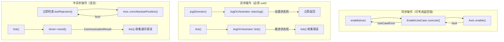

# ViewModel 设计决策分析——为何使用 void 返回值

> **文档版本:** v1.0  
> **分析日期:** 2026-05-17  
> **分析范围:** `AxisViewModelCore` + `QtAxisViewModel`  
> **讨论焦点:** 所有控制指令方法均为 `void` 的设计考量

---

## 目录

1. [问题陈述](#1-问题陈述)
2. [现状全览](#2-现状全览)
3. [设计决策分析](#3-设计决策分析)
4. [替代方案对比](#4-替代方案对比)
5. [结论与建议](#5-结论与建议)
6. [附录：与领域层对比](#6-附录与领域层对比)

---

## 1. 问题陈述

当前 ViewModel 层所有控制指令方法的签名均为 `void`：

```cpp
// AxisViewModelCore.h（当前状态）
void enable(bool active);
void disable();
void jog(Direction dir);
void jogStop(Direction dir);
void moveAbsolute(double targetPos);
void moveRelative(double distance);
void stop();
void setJogVelocity(double v);
void setMoveVelocity(double v);
void zeroAbsolutePosition();
void setRelativeZero();
void clearRelativeZero();
void tick();
```

**质疑：** 这些方法难道不需要返回值来告知调用方执行结果吗？例如 `bool enable(bool active)` 返回是否成功，或者返回错误码/错误信息。

---

## 2. 现状全览

### 2.1 现有的错误反馈机制

ViewModel 层并非完全没有错误反馈，而是采用了**分离式查询**模式：

```cpp
// 方法调用（无返回值）
vm.enable(true);

// 通过独立接口查询错误
if (vm.hasError()) {
    auto err = vm.lastError();
    // err.code, err.userMessage, err.category
}
```

### 2.2 错误收集管道

```
用户调用方法
    │
    ├─ UseCase 同步路径（enable, stop）:
    │     execute() → UseCaseError (variant<monostate, RejectionReason, ...>)
    │     ↓
    │   ErrorTranslator::translate(UseCaseError) → ViewModelError
    │     ↓
    │   存入 m_lastError / m_hasError
    │
    ├─ Orchestrator 异步路径（jog, moveAbsolute, moveRelative）:
    │     startJog() → 编排器开始执行
    │     tick() 驱动编排器 → tick() 收集错误 → ErrorTranslator → m_lastError
    │
    ├─ Axis 同步 + 异步下发路径（zeroAbsolutePosition, setJogVelocity）:
    │     Axis::操作() → 立即检查 lastRejection()
    │     tick() 中 driver->send() → 检查 CommunicationResult
    │
    └─ tick() 是统一的错误收集点
```

---

## 3. 设计决策分析

### 3.1 决策一：错误查询与指令调用分离（Command-Query Separation）

**理由：** 这是 CQS（Command-Query Separation，命令查询分离）原则的典型应用。

| 分类 | 方法类型 | 签名模式 | 示例 |
|------|---------|---------|------|
| **命令（Command）** | 改变状态，无返回值 | `void` | `enable()`, `jog()`, `stop()` |
| **查询（Query）** | 返回状态，无副作用 | `bool` / `double` | `hasError()`, `state()`, `absPos()` |

**优点：**
- 命令方法职责单一——只负责发起操作
- 查询方法无副作用——可安全多次调用
- 调用者和观察者的视角分离，阅读代码时意图清晰

### 3.2 决策二：tick() 驱动模式（Push vs Pull）

这是最核心的原因。ViewModel 采用**推模式（tick-driven push）** 而非**拉模式（return-value pull）**：

```
拉模式（如果有返回值）:
    bool success = vm.enable(true);    // 同步等待结果
    if (!success) { /* 处理错误 */ }

推模式（当前设计）:
    vm.enable(true);           // 发指令（不等待）
    vm.tick();                 // 驱动状态机推进（统一推进点）
    if (vm.hasError()) { ... } // 查询积累的错误（统一查询点）
```

**为什么推模式更适合当前架构：**

| 方面 | 拉模式（返回 bool） | 推模式（void + tick） |
|------|-------------------|---------------------|
| **异步操作** | 无法表达（jog/move 需要时间） | 天然支持（tick 中持续收集） |
| **多步骤错误** | 只返回初始步骤结果 | 可以收集全生命周期错误 |
| **QML 绑定** | 需要 wrapper 转换 | 直接绑定 Q_PROPERTY |
| **驱动频率** | 无用例无关 | 与 tick 频率同步 |
| **Orchestrator 集成** | 无法融合 | tick() 是统一入口 |

### 3.3 决策三：与 QML / Qt 信号机制的适配

QML 侧通过 QtAxisViewModel 与 C++ ViewModel 通信。Qt 的信号/槽机制本质上是**异步推送模式**：

```qml
// QML 调用（Q_INVOKABLE 无法接收返回值）
Button {
    onClicked: viewModel.moveAbsolute(100.0)
}

// QML 通过属性绑定接收状态更新（被动接收）
Label {
    text: viewModel.hasError ? viewModel.errorCode : ""
}
```

**关键约束：**
- `Q_INVOKABLE` 方法可以有返回值，但 QML 调用者无法消费（JavaScript 是事件驱动的）
- `Q_PROPERTY` + `NOTIFY signal` 才是 QML 接收数据更新的标准方式
- 即使 C++ 方法返回 `bool`，QML 中仍然需要绑定 `hasError` 属性来判断错误

```qml
// 如果 enable() 返回 bool（这行不通）
Button {
    onClicked: {
        var ok = viewModel.enable(true);  // ❌ QML 无法评估返回值
        if (!ok) { /* 无法处理 */ }
    }
}

// 正确的 QML 模式
Button {
    onClicked: viewModel.enable(true)
}
Label {
    text: viewModel.hasError ? "失败: " + viewModel.errorMessage : "成功"
}
```

**结论：** 即使 ViewModel 方法返回 `bool`，QML 消费侧也不会有任何改善，因为 QML 不是通过返回值获取反馈的。

### 3.4 决策四：多错误来源需要统一收集点

分析 `tick()` 中的错误收集逻辑：

```cpp
void AxisViewModelCore::tick() {
    // 三个 Orchestrator 可能同时产生错误
    m_jogOrch->tick();
    m_absOrch->tick();
    m_relOrch->tick();

    // 每个 tick 周期最多收集 3 个错误
    if (m_jogOrch->hasError()) { ... }  // 错误 1
    if (m_absOrch->hasError()) { ... }  // 错误 2（覆盖错误 1）
    if (m_relOrch->hasError()) { ... }  // 错误 3（覆盖错误 2）
    
    // 同时消费零位/速度命令的异步下发结果
    consumePendingCommands();  // 错误 4
}
```

如果改用返回值模式，每个方法只能报告"发起时刻"的错误：

```
时序箭头 →
────────────────────────────────────────────────────
vm.jog(Forward);       // 返回 true（发起成功）
vm.tick() → 编排器执行 → 触碰限位 → 错误！
                       // ⚠ 此时已经无法通知 caller
                       // caller 只能通过 hasError() 查询
```

**异步错误无法通过同步返回值表达。** 而 `tick()` 是 ViewModel 的统一心跳，在这里收集所有异步错误是唯一合理的位置。

### 3.5 决策五：bool 返回值的语义陷阱

```cpp
// 场景：enable() 返回 bool 时
bool ok = vm.enable(true);
// ok == true 真的代表"使能成功了吗"？
// 还是"使能指令已经发出去了"？
// 还是"UseCase 执行没有抛出异常"？

// 实际上 enable() 内部：
auto result = m_enableUc->execute(m_manager, m_groupName, m_axisId, active);
// result 可能是 monostate（成功）或 RejectionReason（拒绝）
// 但 UseCase 成功只是"指令被 Axis 领域逻辑接受"，
// 并不代表"硬件已经上电"。
```

**Bool 的语义太模糊。** 是"指令下发成功"、"领域逻辑接受"、"硬件执行完成"还是"整体操作成功"？不同操作有不同的语义边界：

| 操作 | "返回 true"的含义 | 实际何时完成 |
|------|------------------|-------------|
| `enable(true)` | 指令被 Axis 领域逻辑接受 | 硬件响应可能需要时间 |
| `jog(Forward)` | Orchestrator 启动成功 | 硬件开始运动后才算完成 |
| `moveAbsolute(100)` | Orchestrator 启动成功 | 到达目标位置后才算完成 |
| `stop()` | Stop指令下发成功 | 轴完全停止后才算完成 |
| `setJogVelocity(10)` | Axis 领域操作成功 | 驱动确认速度变更后才算 |

**如果返回 bool，caller 无法区分"指令已发出"和"操作已完成"。** 而当前 void + hasError() 模式明确表示："指令已发出，后续结果请通过 hasError() 查询"。

### 3.6 决策六：ViewModel 是门面（Facade）而非验证层

ViewModel 的职责是**编排和转发**，不是**验证和执行**：

```
领域层（Axis）:
    bool Axis::enable(bool active);         // 返回 bool，因为这是领域规则
    bool Axis::moveAbsolute(double target);  // 检查状态 + 限位

应用层（UseCase）:
    UseCaseError EnableUseCase::execute(...);  // 返回 variant，因为这是编排逻辑

表现层（ViewModel）:
    void AxisViewModelCore::enable(bool);      // 不返回，因为这是 UI 门面
    void AxisViewModelCore::moveAbsolute();    // 不返回，因为这是 UI 门面
```

领域层使用 `bool` 返回值是因为它执行具体的领域规则检查（状态机、软限位）。ViewModel 层不需要重复这些检查，它的职责是：
1. 将用户意图翻译为应用层的调用
2. 将应用层/领域层的错误翻译为 UI 友好格式
3. 通过 tick() 把状态推送给 UI

---

## 4. 替代方案对比

### 方案 A：当前方案（void + hasError + tick）

```
pros:
  ✅ 与 QML/Qt 信号机制天然匹配
  ✅ 支持异步操作和 Orchestrator 编排
  ✅ 多错误来源统一收集
  ✅ Command-Query Separation 清晰
  ✅ tick() 是唯一的推进点，没有同步/异步双重状态

cons:
  ❌ 调用者需要记住检查 hasError()
  ❌ 错误与操作之间的关联不直观
  ❌ 测试时需要额外步骤检查错误
```

### 方案 B：返回 bool

```cpp
bool enable(bool active);          // true=成功
bool jog(Direction dir);           // true=编排器启动成功
bool moveAbsolute(double target);  // true=编排器启动成功
```

```
pros:
  ✅ 简单直观，"看一眼就知道是否成功"
  ✅ 同步操作调用方不需要额外步骤

cons:
  ❌ 只反映"发起时刻"的状态，错过后续异步错误（#1 致命缺陷）
  ❌ QML 侧无法消费返回值（#2 致命缺陷）
  ❌ bool 语义模糊：是"指令发出"还是"操作完成"？
  ❌ 调用方可能忽略返回值（return value ignored 陷阱）
  ❌ 与 tick() 驱动模式冲突，引入"同步返回 vs 异步收集"双重路径
```

**结论：不推荐。** 失去异步错误追踪能力是致命问题。

### 方案 C：返回 ErrorCode / ViewModelError

```cpp
ViewModelError enable(bool active);  // 空 = 成功，非空 = 错误
ViewModelError jog(Direction dir);
ViewModelError moveAbsolute(double target);
```

```
pros:
  ✅ 返回具体错误信息，比 bool 丰富
  ✅ 调用方可立即处理同步错误

cons:
  ❌ 与方案 B 同样的问题：无法追踪异步错误
  ❌ QML 侧 Q_INVOKABLE 返回值无法消费
  ❌ ErrorTranslator 需要在每个方法中执行（代码重复）
  ❌ tick() 中还需要再收集 Orchestrator 的错误——双重路径
  ❌ 调用方同样可能忽略返回值
```

**结论：不推荐。** 与方案 B 类似的缺陷。

### 方案 D：out-param + void（类似 GError 风格）

```cpp
void enable(bool active, ViewModelError* outError);
void jog(Direction dir, ViewModelError* outError);
```

```
pros:
  ✅ C 语言经典错误处理模式
  ✅ 明确区分"正常输出"和"错误输出"

cons:
  ❌ C++ 中不直观，参数列表膨胀
  ❌ 与方案 B/C 同样的问题：无法追踪异步错误
  ❌ 调用方仍需在 tick() 后检查 Orchestrator 错误
  ❌ out-param 在现代化 C++ 中已被 std::optional / std::expected 淘汰
```

**结论：不推荐。** 风格老旧，且无法解决异步问题。

### 方案 E：future/promise 模式

```cpp
std::future<bool> enable(bool active);
std::future<bool> moveAbsolute(double target);
```

```
pros:
  ✅ 同步/异步统一接口
  ✅ 调用方可以 wait() 等待完成，也可以 continue_with()

cons:
  ❌ Qt/QML 环境没有标准 future 集成
  ❌ QML 侧无法消费 std::future
  ❌ 引入线程和同步复杂性
  ❌ tick() 驱动模式与此冲突
```

**结论：不推荐。** 与 Qt 环境不兼容，过度设计。

### 方案 F：混合模式（本文推荐之选）

```cpp
// 同步操作（有即时结果）:
bool enable(bool active);        // UseCase 执行有同步结果

// 异步操作（由 tick 驱动）:
void jog(Direction dir);          // Orchestrator 异步执行
void moveAbsolute(double target); // Orchestrator 异步执行

// 统一通过 hasError() 查询所有错误
bool hasError() const;
ViewModelError lastError() const;
void clearError();
```

```
pros:
  ✅ enable() 是真正同步的，返回 bool 没有异步问题
  ✅ jog/moveAbsolute 等异步操作不受返回值限制
  ✅ 调用方知道哪些操作需要额外检查错误
  ✅ 所有错误最终统一到 hasError() 查询

cons:
  ❌ 接口风格不统一（有些返回 bool，有些不返回）
  ❌ 调用方需要记住：enable() 通过返回值检查，其余通过 hasError()
  ❌ 与 Command-Query Separation 原则妥协
```

**分析：`enable()` 是否适合返回 bool？**

```cpp
// enable() 的调用链是同步的：
// enable(bool) → EnableUseCase::execute() → Axis::enable(bool) → 返回 bool
// 整个过程在同一个线程、同一个调用栈中完成

// 对比 jog() 的调用链是异步的：
// jog(Direction) → JogOrchestrator::startJog() → 设置状态机 → 立即返回
// 真正的执行在 tick() 中完成
```

**结论：`enable()` 返回 bool 是合理的，因为它的执行是同步的。** 但需要注意：
1. `enable(false)` 不应覆盖已有错误（修复缺陷 #4）
2. QML 侧需要通过 `isEnabled` 属性感知状态，而非返回值
3. C++ 侧调用 `enable()` 时可以受益于返回值

### 方案 G：std::expected（C++23 风格）

```cpp
// 如果项目使用 C++23
std::expected<void, ViewModelError> enable(bool active);
std::expected<void, ViewModelError> jog(Direction dir);
```

```
pros:
  ✅ 类型安全的错误返回
  ✅ 调用方必须处理错误（[[nodiscard]]）
  ✅ 标准化的错误处理模式

cons:
  ❌ 项目中可能未使用 C++23
  ❌ QML 侧依然无法消费
  ❌ 异步操作仍然需要 tick() 补充错误收集
```

**结论：如果未来升级到 C++23 可考虑，但不改变异步问题的本质。**

---

## 5. 结论与建议

### 5.1 最终推荐方案

**维持当前 void + hasError + tick 模式，不做根本性改动。** 理由：

| 维度 | 评估 |
|------|------|
| **架构一致性** | ✅ void + tick + hasError 是完整自洽的模式 |
| **QML 兼容性** | ✅ Q_PROPERTY + Q_INVOKABLE 无返回值问题 |
| **异步支持** | ✅ Orchestrator 异步错误可被 tick() 收集 |
| **多错误来源** | ✅ tick() 统一收集三个 Orchestrator + 命令下发错误 |
| **Command-Query Separation** | ✅ 严格遵守 |
| **可测试性** | ⚠️ 需要额外检查，但测试框架能接受 |

### 5.2 改进建议（Tier 1 — 推荐立即实施）

```cpp
// 给每个控制方法增加 [[nodiscard]] 的替代模式？
// 不，给 hasError() 和 tick() 增加文档说明

/**
 * @brief 发起使能操作。操作结果通过后续 tick() + hasError() 查询。
 * 
 * 使用示例：
 *   vm.enable(true);
 *   vm.tick();                           // 推进状态机
 *   if (vm.hasError()) {                 // 查询结果
 *       auto err = vm.lastError();
 *   }
 */
void enable(bool active);
```

### 5.3 改进建议（Tier 2 — 可选优化）

```cpp
// 为 C++ 调用者增加便捷方法，同时保留 void 版本

// 选项 A：增加错误码重载
ViewModelError tryEnable(bool active);  // 同步查错
// 内部实现：
ViewModelError AxisViewModelCore::tryEnable(bool active) {
    enable(active);
    tick();  // 立即推进一次，收集即时错误
    return lastError();
}
```

**但需注意：** `tryEnable()` 破坏了 tick() 驱动模型的一致性——如果在 Orchestrator 执行过程中调用 `tryEnable()`，可能会导致意外的状态推进。

```cpp
// 选项 B：不增加重载，仅增强文档和测试覆盖
// 如上所述，当前模式是合理的，无需增加返回值
```

### 5.4 最终立场

```
┌─────────────────────────────────────────────────────────────────┐
│  void 返回值是 ViewModel 层经过深思熟虑的设计决策，不是疏忽。       │
│                                                                   │
│  核心原因：                                                       │
│  1. tick() 驱动模式需要统一的推进点，不适合同步返回值               │
│  2. QML 通过 Q_PROPERTY 接收状态更新，不消费 Q_INVOKABLE 返回值    │
│  3. 异步操作（jog/move）的错误只能在 tick() 中被收集               │
│  4. 多错误来源（三个 Orchestrator + 命令下发）需要统一收集点        │
│  5. 严格遵守 Command-Query Separation 原则                       │
│                                                                   │
│  改进方向：无需改为返回值模式，而应完善错误收集模型                   │
│  （将单值 m_lastError 升级为列表 m_errorHistory）                   │
└─────────────────────────────────────────────────────────────────┘
```

---

## 6. 附录：与领域层对比

| 层级 | 类 | 方法签名 | 返回类型 | 原因 |
|------|-----|---------|---------|------|
| **领域层** | `Axis` | `enable(bool)` | `bool` | 领域规则检查有同步结果 |
| | `Axis` | `moveAbsolute(double)` | `bool` | 状态机 + 限位检查，纯同步 |
| | `Axis` | `state()` | `AxisState` | 纯查询，无副作用 |
| **应用层** | `EnableUseCase` | `execute(...)` | `UseCaseError` (variant) | 编排逻辑，可返回多种错误 |
| | `JogAxisUseCase` | `execute(...)` | `UseCaseError` | 编排逻辑 |
| | `JogOrchestrator` | `tick()` | `void` | 状态机驱动，异步推进 |
| | `AutoAbsMoveOrchestrator` | `tick()` | `void` | 状态机驱动，异步推进 |
| **表现层** | `AxisViewModelCore` | `enable(bool)` | `void` | UI 门面，tick 驱动 |
| | `AxisViewModelCore` | `jog(Direction)` | `void` | UI 门面，tick 驱动 |
| | `AxisViewModelCore` | `state(), hasError()` | 有返回值 | 纯查询 |

**规律：**
- 纯同步操作 → 有返回值（`Axis::enable()` / `Axis::state()`）
- 纯查询 → 有返回值（`AxisViewModelCore::state()`）
- 异步/编排操作 → void（`Orchestrator::tick()` / `ViewModelCore::jog()`）
- UI 门面 → void（`ViewModelCore::enable()`）

这个规律在各层是一致的，ViewModel 层采用 void 返回值是架构风格的延续，而非异常。

---

## 附录 A：各操作的实际执行路径分类



| 操作 | 同步步骤 | 异步步骤 | 适合返回值吗？ |
|------|---------|---------|-------------|
| `enable(true)` | ✅ 全部同步 | ❌ 无 | 可以考虑 |
| `disable()` = `enable(false)` | ✅ 全部同步 | ❌ 无 | 可以考虑 |
| `jog()` | ❌ 无 | ✅ Orchestrator 状态机 | 不适合 |
| `jogStop()` | ❌ 无 | ✅ Orchestrator 状态机 | 不适合 |
| `moveAbsolute()` | ❌ 无 | ✅ Orchestrator 状态机 | 不适合 |
| `moveRelative()` | ❌ 无 | ✅ Orchestrator 状态机 | 不适合 |
| `stop()` | ⚠️ 部分同步 | ⚠️ 中断 jog 编排器 | 勉强可行但不一致 |
| `zeroAbsolutePosition()` | ✅ Axis 检查 | ✅ driver->send() | 只反映一半状态 |
| `setJogVelocity()` | ✅ Axis 检查 | ✅ driver->send() | 只反映一半状态 |
| `setMoveVelocity()` | ✅ Axis 检查 | ✅ driver->send() | 只反映一半状态 |

---

## 附录 B：如果改为返回值——QML 侧的困境

**当前设计**（QML 通过属性获取反馈）：
```qml
Button {
    onClicked: viewModel.enable(true)    // 无返回值，QML 无感知
}
Label {
    // 通过属性绑定自动获取状态变化
    text: {
        if (!viewModel.hasError) return "已使能";
        return "使能失败: " + viewModel.errorMessage;
    }
    color: viewModel.hasError ? "red" : "green"
}
```

**如果 enable() 返回 bool**（QML 的困境）：
```qml
Button {
    onClicked: {
        // 方式 1：QML 无法接收 C++ 返回值（Q_INVOKABLE 有返回值也无法使用）
        // var ok = viewModel.enable(true);   ❌ 语法错误
        
        // 方式 2：C++ 侧存储结果，QML 侧检查
        viewModel.enable(true);  // 仍无返回值
        // 仍然需要 hasError 属性来获取结果
    }
}
Label {
    // 依然只能通过属性绑定
    text: viewModel.hasError ? "失败" : "成功"
}
```

**结论：QML 侧根本无法消费 C++ 返回值，无论是否返回 bool。**

---

*本文档分析了 AxisViewModelCore 中所有控制方法使用 void 返回值的设计原因，并对比了 7 种替代方案。最终结论是：void + tick + hasError 是适合当前架构的设计，改进重点应放在错误收集模型升级（单值→列表）而非返回值改造。*
