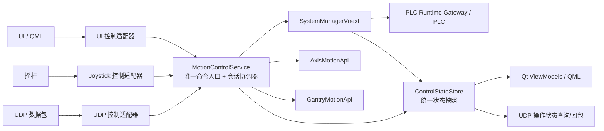

# MotionControlService —— 统一控制协调层阶段实施文档

> 状态：**设计已修订定稿（v3，补齐 P0 缺口），待实施。** 本文档把「谁发起操作」与
> 「谁展示状态」彻底分开，新增 `application_vnext::MotionControlService` 作为唯一
> 控制协调者（命令入口、仲裁、轮询、会话持有、状态发布），UI / 摇杆 / UDP 一律降级
> 为「命令来源」，只提交业务意图命令，不再直接写 PLC、不再持有策略、不再各自 tick。
>
> 关键约束：
> - 安全/连接状态经新增 `IControlRuntime`（非 `IPlcDriver`）纳入协调层并据此全局锁定；
> - `submit()` 只入队（`Queued`），仲裁后才 `Accepted/Rejected`；`ControlStateStore`
>   纯 C++ 不回调 Qt；
> - 租约按 `ControlResource` **多资源粒度**（一操作可占多资源，含龙门组与成员轴）；
> - tick 中**急停先于同步 PLC 读取**；`ISessionPolicy` 支持受控取消/停止；
> - 点动心跳按单调时钟 deadline 驱动；急停/停止不被 TTL 丢弃；
> - 断线/不可信/Revision 变化禁止重放；`Start*Move` 携带目标与速度为原子意图；
> - 每 tick 只经 `IControlRuntime` 读一次 runtime，经 `applyRuntimeSnapshot()` 注入同一份快照。
>
> 依据：《application_vnext架构与接口说明》、《龙门联动运动策略——application_vnext
> 实施文档》、《摇杆适配流程规划》、《servoV6剩余迁移工作实施方案》。

---

## 1. 背景与问题

当前运动控制存在「发起」与「展示」耦合、多点 tick、策略对象散落各层的现象：

| 来源 | 现状 | 问题 |
| --- | --- | --- |
| UI | `QtAxisViewModel` 经 `AxisViewModelCore` 直接调旧 `SystemManager` 与策略 | UI 直接写 PLC、自行 tick 策略 |
| 摇杆 | `MotionController` 持有 `QtAxisViewModel*`，调用 `jogPositivePressed()` | 摇杆穿透 ViewModel 直接驱动运动，绕过统一状态 |
| UDP | `UdpCommandDispatcher` 持有 `AbsMovePolicy`/`RelMovePolicy` 并循环 tick 跑完 | UDP 阻塞式等待定位完成；UI 无法同步；策略并发风险 |

**核心矛盾**：三类来源各自 `poll()`、各自 `tick()`、各自持有策略对象，
导致「UDP 控制了，但 UI 没有顺畅同步」，且存在状态机并发写的隐患。

---

## 2. 目标与设计原则

> **UI、摇杆和 UDP 是三个「命令来源」；PLC 反馈和应用会话状态是唯一「状态来源」。**
> 任何来源都不能绕过 `MotionControlService` 直接写 PLC，也不能自行维护运动状态。

1. **单一入口**：只有 `MotionControlService` 能调用
   `SystemManagerVnext` / `AxisMotionApi` / `GantryMotionApi`；
   `PhysicalAxisCommissioningService` 仅允许**维护模式**入口访问，UI/UDP 常规入口不可触达。
   `systemManager()/axisApi()/gantryApi()` **不作为公开可写入口暴露**（见 §5.1），
   否则会绕过统一仲裁。
2. **统一命令模型**：三种来源转换为同一种 `ControlCommand`，不携带 PLC 地址，只描述业务意图。
3. **唯一调度循环**：UI / UDP / 摇杆不再各自 tick；由 `MotionControlService` 每 20~50 ms
   统一：取出命令 → **优先急停/停止** → 读反馈与安全 → 更新领域与全局锁定 → 过期 →
   仲裁 → tick 会话 → 发布快照（**急停先于同步 PLC 读取**，见 §5.2）。
4. **异步回执 + 状态拆分**：UDP/UI 调用 `submit()` 只说明「已入队」，不能说明 PLC 已接受。
   状态流为 `Queued → Accepted/Rejected → Running → Succeeded/Failed/TimedOut/CommitUncertain`，
   UI 可顺畅显示「已点击、排队、等待 PLC、执行中、完成/失败」，UDP 经 `operationId` 查询最终结果。
5. **PLC 反馈为准**：位置、速度、motionState、报警、限位、急停、龙门许可一律以
   PLC poll 后的反馈快照为准；「已排队 / 等待 PLC / 正在建立联动 / 正在点动」为 application 操作状态。
6. **安全与连接状态纳入协调层**：`tick()` 每轮**经 `IControlRuntime`** 读取 runtime、safety、
   连接状态；任何一次 safety 读取失败、断线、反馈不可信、Revision 变化，都**立即锁定普通
   控制**并终止本地会话，绝不在重连后自动重放运动。状态来源与「全局锁定」都归协调层唯一维护。
   急停写（M224，软件急停请求）在读取前优先提交；现场硬件急停仍独立于上位机。

---

## 3. 总体架构



依赖方向（与现有 vnext 一致）：

```text
UI/摇杆/UDP(纯适配器)  →  MotionControlService  →  SystemManagerVnext
                                                    ├─ AxisMotionApi      → 策略会话
                                                    ├─ GantryMotionApi    → 生命周期+逻辑轴会话
                                                    └─ PLC Runtime Gateway / PLC
MotionControlService → ControlStateStore → Qt ViewModel / QML / UDP 回包
```

---

## 4. 统一命令模型

### 4.1 新增文件 `application_vnext/control/ControlCommand.h`

```cpp
#pragma once

#include <chrono>
#include <cstdint>
#include <string>

#include "domain_vnext/model/AxisFunction.h"
#include "infrastructure/plc_vnext/contracts/PlcGroupIndex.h"

namespace application_vnext::control {

/// 命令来源（全链路追踪与仲裁用）。
enum class ControlSource {
    Ui,           // QML 按钮 / 面板
    Joystick,     // 摇杆 / 手柄
    Udp,          // UDP 数据包
    Maintenance,  // 维护模式（仅 PhysicalAxisCommissioningService 经由此源）
};

/// 业务目标轴：组 + 功能角色。不携带 PLC 槽位/地址。
struct AxisTarget {
    plc_vnext::contracts::PlcGroupIndex group{0};
    domain_vnext::model::AxisFunction function = domain_vnext::model::AxisFunction::X;
};

enum class ControlAction {
    SetManualSpeed,
    SetPositioningSpeed,
    SetAbsTarget,
    SetRelTarget,

    StartJogForward,
    StartJogBackward,
    StopJog,

    StartAbsMove,
    StartRelMove,
    StopMotion,

    EnableAxis,
    EnableMotor,

    GantryEnableAndCouple,
    GantryDecoupleAndDisable,

    EmergencyStop,
    ReleaseEmergencyStop,
};

/// 统一控制命令：不携带 PLC 地址，只描述业务意图。
struct ControlCommand {
    std::string operationId;                       // 全链路追踪、UDP 回包关联
    ControlSource source = ControlSource::Ui;
    AxisTarget target;
    ControlAction action{};
    float value = 0.0f;                            // SetManualSpeed/SetPositioningSpeed/SetAbsTarget/SetRelTarget
    bool level = false;                            // EnableAxis/EnableMotor 的 on；StartJog 预留
    std::chrono::steady_clock::time_point createdAt = std::chrono::steady_clock::now();
    std::chrono::milliseconds ttl{1000};           // 超时未被执行则丢弃（TimedOut）
};

/// 可读名称（日志 / UDP 回包 / 诊断）。
inline const char* controlSourceName(ControlSource s);
inline const char* controlActionName(ControlAction a);

}  // namespace application_vnext::control
```

### 4.2 三个来源的转换示例

```text
UI 点“相对移动”
→ { source=Ui,   target=A/Y, action=StartRelMove }

摇杆按住正方向
→ { source=Joystick, target=A/Y, action=StartJogForward }

UDP 收到移动包
→ { source=Udp, target=A/Y, action=StartRelMove, operationId="udp-42" }
```

三者进入同一个线程安全队列，最终只由 `MotionControlService` 执行。

---

## 5. 唯一控制协调器 MotionControlService

### 5.1 新增文件 `application_vnext/control/MotionControlService.h`

```cpp
#pragma once

#include <array>
#include <chrono>
#include <condition_variable>
#include <deque>
#include <map>
#include <memory>
#include <mutex>
#include <optional>
#include <string>

#include "application_vnext/control/ControlCommand.h"
#include "application_vnext/control/ControlStateStore.h"
#include "application_vnext/policy/AxisMotionApi.h"
#include "application_vnext/policy/GantryMotionApi.h"

namespace application_vnext::control {

/// 控制资源（租约键）：轴资源 或 龙门组资源。
/// 抽象为统一资源串，便于结构性互斥：
///   axis:A:slot2     —— 单轴（由 AxisTarget 解析出实际 slot）
///   axis:A:X1        —— 成员轴单轴命令
///   gantry:A:0       —— 龙门组资源（建立/解除/逻辑轴运动均申请）
struct ControlResource {
    std::string key;                       // "axis:A:slot2" / "gantry:A:0"

    /// 从 AxisTarget 构造资源键；龙门相关动作统一映射到该组 gantry 资源。
    static ControlResource ofAxis(const AxisTarget& t);
    static ControlResource ofGantry(plc_vnext::contracts::PlcGroupIndex g);

    bool operator==(const ControlResource&) const = default;
    bool operator<(const ControlResource& o) const { return key < o.key; }
};

/// 一个操作的运行租约：**一个操作可占多个资源**（决定占用者与能否抢占）。
struct OperationLease {
    std::string operationId;
    ControlSource owner = ControlSource::Ui;
    std::vector<ControlResource> resources;   // 操作占用的全部资源（可多个）
    AxisTarget target;                        // 仅用于展示/回包
    OperationKind kind = OperationKind::Positioning;   // 见 ControlStateStore.h
};

/// 资源索引：resource.key -> 持有该资源的 operationId。
/// 仲裁据此判断占用/抢占；龙门与成员轴的互斥由「资源集合重叠」天然保证，
/// 不依赖遗漏风险较高的特殊 if/else。
using ResourceIndex = std::map<std::string, std::string>;

class IControlRuntime;
class MotionControlService {
public:
    /// 注入领域驱动（拓扑/运行/单轴写/龙门提交）与应用层运行时（safety/连接/急停）。
    /// 不要把 IPlcRuntimeGateway 直接塞给 domain 的 IPlcDriver；由本接口承载
    /// 协调层需要的 safety/连接/急停能力（见 §5.1 下方的 IControlRuntime 定义）。
    MotionControlService(domain_vnext::gateway::IPlcDriver& driver,
                         IControlRuntime& runtime);

    /// 命令入口（线程安全）：任何来源调用，立即返回 Queued + operationId。
    /// 状态先置 Queued；由唯一 tick 在仲裁后转为 Accepted/Rejected。
    std::string submit(ControlCommand cmd);

    /// 操作状态查询（UDP / UI 用）。
    std::optional<OperationEntry> queryOperation(const std::string& operationId) const;

    /// 唯一调度循环：读反馈/安全/连接 → 更新领域与全局锁定 → 优先急停/停止/过期
    /// → 仲裁并启动新操作 → 推进会话 → 发布快照。见 §5.2。
    void tick();

    /// 快照存储（供 Qt ViewModel / UDP 查询，纯 C++、线程安全）。
    ControlStateStore& store();

    // ---- 组合根 ----
    // 注意：systemManager/axisApi/gantryApi **不**公开。它们仅在本类内部使用，
    // 由 arbitrate/execute 唯一触碰，杜绝外部绕过仲裁直接写 PLC。

private:
    std::string nextOperationId(ControlSource src);

    void drainQueue(std::vector<ControlCommand>& out);
    void handleUrgent(std::vector<ControlCommand>& cmds); // 急停/停止 优先（读前）
    void readFeedbackAndSafety();                         // 唯一一次 runtime+safety+连接
    void updateDomainAndLock();                           // 更新领域与全局锁定
    void expireCommands();                                // 处理已过期普通命令（TimedOut）
    void arbitrate(ControlCommand& cmd);                  // 占用/抢占规则（多资源粒度）
    void execute(ControlCommand& cmd);                    // 落地到 Axis/Gantry Api
    void tickSessions();                                  // tick 所有进行中的会话
    void publishSnapshot();                               // 写 ControlStateStore

    // ---- 组合根 ----
    application_vnext::SystemManagerVnext       sysManager_;
    application_vnext::policy::AxisMotionApi    axisApi_;
    application_vnext::policy::GantryMotionApi  gantryApi_;
    IControlRuntime&                            runtime_;   // 注入的应用层运行时

    // ---- 线程安全命令队列 ----
    mutable std::mutex              qMtx_;
    std::deque<ControlCommand>      queue_;

    // ---- 租约与会话（资源粒度，一操作多资源）----
    std::vector<OperationLease>                 leases_;        // 进行中的租约集合
    ResourceIndex                               resourceIndex_; // 资源 -> operationId
    std::map<std::string, std::shared_ptr<ISessionPolicy>> sessions_;

    // ---- 安全 / 连接 / 全局锁定 ----
    plc_vnext::contracts::SafetySnapshot  lastSafety_;
    plc_vnext::contracts::ConnectionState lastConn_;
    bool globallyLocked_ = true;                     // 初始锁定，boot+首读可信后才释放
    ControlStateStore                             store_;
};

}  // namespace application_vnext::control
```

**安全/连接/急停能力必须走独立的应用层最小接口，不能依赖 `IPlcDriver`**。
现有 `domain_vnext::gateway::IPlcDriver` 只有 `readTopology()/readRuntime()/writeAxis()/
submitGantryRequest()`，**没有** `readSafety()/connectionState()/triggerEmergencyStop()/
requestEmergencyStopRelease()`；这些定义在 `plc_vnext::IPlcRuntimeGateway`。为保持
依赖边界清晰（domain 驱动不依赖基础设施运行时接口），在 application_vnext 新增：

```cpp
// application_vnext/control/IControlRuntime.h
namespace application_vnext::control {

/// 协调层需要的最小运行时读/写接口；由应用层适配器实现为对
/// plc_vnext::IPlcRuntimeGateway 的委托。不 include domain 的 IPlcDriver。
class IControlRuntime {
public:
    virtual ~IControlRuntime() = default;

    virtual plc_vnext::contracts::ReadResult<plc_vnext::contracts::RuntimeSnapshot>
        readRuntime() = 0;
    virtual plc_vnext::contracts::ReadResult<plc_vnext::contracts::SafetySnapshot>
        readSafety() = 0;
    virtual plc_vnext::contracts::ConnectionState connectionState() const = 0;

    virtual plc_vnext::contracts::CommunicationResult triggerEmergencyStop() = 0;
    virtual plc_vnext::contracts::CommunicationResult requestEmergencyStopRelease() = 0;
};

}
```

`MotionControlService` 注入 `IPlcDriver& + IControlRuntime&`（见 §5.1 构造函数），
`readFeedbackAndSafety()` 经 `runtime_` 每轮读取。该接口同时让 fake 能做完整测试
（`application_vnext/tests/fake/FakeControlRuntime`）。任何一次读取失败/不可信 →
`globallyLocked_=true`，且当前所有普通会话被终止（急停/停止永远不被 TTL 丢弃）。

> `ISessionPolicy` 是 Abs/Rel/Jog/GantryLifecycle 的统一抽象
> （`tick()/requestStop()/cancel()/isStopping()/isDone()/hasError()/diag()/
> currentStep()/resources()`），见 5.3。

### 5.2 唯一调度循环（每 20~50 ms，由 main 单一定时器驱动）

**必须明确执行的顺序**（不允许打乱）。**急停必须排在同步 PLC 读取之前**：当前
Modbus 读取是同步桥接，断网/超时可能卡到 `timeoutMs`，若把急停排在读取之后，
会出现「急停已到队列，却等待一次 runtime/safety 读取结束才写 M224」的违背安全优先级。

```text
MotionControlService::tick()
  1. drainQueue()：取出队列中的全部命令（不执行，仅分类）
  2. 优先处理 EmergencyStop（软件急停请求，写 M224；不被 TTL 丢弃）
  3. 优先处理 Stop / StopJog（不被 TTL 丢弃）
  4. readFeedbackAndSafety()：读取 PLC runtime、safety、连接状态（经 IControlRuntime）
  5. updateDomainAndLock()：更新领域状态与全局锁定状态
     （任何 safety 读取失败 / 断线 / 反馈不可信 / Revision 变化 → 锁定普通控制，
       立即终止本地会话，绝不自动重放运动）
  6. 处理已过期普通命令（置 TimedOut，释放其占用的资源）
  7. arbitrate() + execute()：仲裁并启动新的普通操作（资源粒度租约）
  8. tickSessions()：推进一步进行中的单轴 / 点动 / 龙门会话
  9. publishSnapshot()：发布不可变 ControlStateSnapshot
 10. Qt ViewModel 经定时读取 / QueuedConnection 刷新 QML；UDP 状态查询返回最新
```

**每 tick 只读一次 runtime（实现约束）**：

`IControlRuntime::readRuntime()` 与 `IPlcDriver::readRuntime()` **不得在同一 tick 各读
一次 PLC**。`SystemManagerVnext::poll()` 内部依赖 `IPlcDriver::readRuntime()`，而
`readFeedbackAndSafety()` 经 `IControlRuntime::readRuntime()` 读取；两者底层都落到
`IPlcRuntimeGateway::readRuntime()`（同一串行 I/O 通道）。若各读一次，会造成重复
Modbus 读取、且同一 tick 内两份反馈可能不一致。

正确做法：**每 tick 只经 `IControlRuntime::readRuntime()` 读一次 runtime 快照**，然后
把**同一份快照**注入 / 更新 `SystemManagerVnext` 的领域状态（可新增
`SystemManagerVnext::applyRuntimeSnapshot(const RuntimeSnapshot&)`，避免其内部再走
`poll()` 重复读）。safety 另经 `IControlRuntime::readSafety()` 独立读取一次（本就与
runtime 分开）。仲裁、会话 tick、快照发布都基于这一份唯一 runtime 快照。

**急停原则（补充）**：

- 现场硬件急停仍必须**独立于上位机**（硬线/安全 PLC），上位机的 M224 只是
  **软件急停请求**，不能替代硬件急停。
- 若连接已断，服务**应立即本地取消会话并锁定**，不能假设急停写一定到达 PLC；
  同时仍尝试提交 `triggerEmergencyStop()`。

**点动心跳基于单调时钟 deadline，不依赖「50ms 整除 500ms」**：

```text
Jog 会话仍由 JogPolicy::tick() 驱动
→ 每 tick 判断 now >= nextHeartbeatAt 即发送心跳（deadline，非计数整除）
→ 由 MotionControlService 的唯一 tick 驱动，无独立心跳线程
```

这样保持现有 `JogPolicy` 单线程设计，不引入 UI / UDP / PLC 状态机并发写的问题。
验收时记录：tick 抖动、PLC 事务耗时、心跳实际间隔；最大调度间隔须显著小于
500ms（例如 20~50ms tick）。**UDP 高负载下，点动心跳应优先于普通参数写入**。


### 5.3 会话抽象（复用现有策略，不推翻）

| 现有策略 | 在 `ISessionPolicy` 下的角色 |
| --- | --- |
| `AbsMovePolicy` / `RelMovePolicy` | 定位会话，`StartAbsMove`/`StartRelMove` 创建 |
| `JogPolicy` | 点动会话，`StartJogForward/Backward` 创建，`StopJog` 停止 |
| `GantryLifecyclePolicy` | 龙门建立/解除/掉电会话，`GantryEnableAndCouple`/`GantryDecoupleAndDisable` 创建 |
| `GantryMotionGuard` | 龙门逻辑轴运动时的运行中许可校验（复用） |

新增一个纯抽象 `ISessionPolicy`（建议放 `application_vnext/control/SessionPolicy.h`）：

```cpp
namespace application_vnext::control {
/// 所有策略会话的统一运行抽象；由 MotionControlService 唯一 tick。
/// 必须支持「受控取消/停止」，否则 Stop、急停、失联、RevisionChanged 时
/// 仅从 sessions_ 删除对象不足以安全终止（点动要写方向 OFF 并停心跳、
/// 定位要调 stop()、龙门要进入明确的失败/取消态）。
struct ISessionPolicy {
    virtual ~ISessionPolicy() = default;
    virtual void tick() = 0;

    // ---- 受控取消 / 停止 ----
    virtual void requestStop() = 0;               // 优雅停止（Stop/StopJog）
    virtual void cancel(std::string_view reason) = 0;  // 强制取消，保留原因供 UI/UDP
    virtual bool isStopping() const = 0;

    // ---- 运行状态 ----
    virtual bool isDone() const = 0;
    virtual bool hasError() const = 0;
    virtual std::string diag() const = 0;
    virtual std::string currentStepName() const = 0;

    // ---- 资源 ----
    virtual std::vector<ControlResource> resources() const = 0;  // 本会话占用的资源集合
};
}
```

`MotionControlService` 通过适配器把 `AbsMovePolicy/RelMovePolicy/JogPolicy/
GantryLifecyclePolicy` 包成 `ISessionPolicy`，屏蔽各策略差异，统一收进 `sessions_`：
`requestStop()` 映射到 Jog 的停止 / 定位的 `stop()`；`cancel(reason)` 用于急停、
失联、RevisionChanged 的强制终止并保留取消原因。

**目标值归属（补充）**：`SetAbsTarget/SetRelTarget` 与 `StartAbsMove/StartRelMove`
分开时，必须定义「运动会话锁定哪个目标值」。**更稳妥的是让 `StartAbsMove/StartRelMove`
自身携带目标和速度，成为一次原子业务意图**；单独 `Set*` 命令仅用于界面预填值，
不参与运动启动时机的取值竞争。

---

## 6. 状态快照与控制状态存储

### 6.1 新增文件 `application_vnext/control/ControlStateStore.h`

```cpp
#pragma once

#include <array>
#include <string>
#include <vector>

#include "infrastructure/plc_vnext/contracts/AxisRuntimeSnapshot.h"
#include "infrastructure/plc_vnext/contracts/ConnectionState.h"
#include "infrastructure/plc_vnext/contracts/GantryStatusSnapshot.h"
#include "infrastructure/plc_vnext/contracts/SafetySnapshot.h"

namespace application_vnext::control {

/// 操作生命周期状态（UI 与 UDP 展示、UDP 回包）。
/// 提交后状态流：
///   Queued → Accepted/Rejected → Running → Succeeded/Failed/TimedOut/CommitUncertain
enum class OperationState {
    Queued,           // 已入队，等待唯一 tick 仲裁
    Accepted,         // 仲裁通过，已提交给 PLC（写入结果未知前）
    Rejected,         // 仲裁拒绝（资源占用 / 锁定 / 非法）
    Running,          // PLC 已确认进入执行（motionState / AckSeq 反馈）
    Succeeded,        // 完成（PLC 空闲 / 到位校验通过）
    Failed,           // 失败（限位 / 报警 / 超时等）
    Cancelled,        // 被急停 / Stop / 更高优先级取消
    TimedOut,         // TTL 超时未被执行（仅普通运动启动命令）
    CommitUncertain,  // 已写入但结果未知（通讯不确定，等待观察）
};

enum class OperationKind {
    Positioning,    // Abs / Rel
    Jog,            // 点动
    GantryLifecycle,// 建立 / 解除 / 掉电
};

/// 单轴 UI 状态（由 PLC 反馈快照 + 拓扑 + 租约投影）。
/// 除 slot 外必须携带 AxisTarget/group/role/hmiVisible，UI 不应自行推导轴映射。
struct AxisUiState {
    int16_t slot = 0;                       // PLC 槽位下标
    plc_vnext::contracts::PlcGroupIndex group{0};       // 组
    domain_vnext::model::AxisFunction role =            // 功能角色 X/X1/X2/Y/Z/R
        domain_vnext::model::AxisFunction::X;
    bool hmiVisible = false;                // 拓扑是否允许 UI 显示
    bool bound = false;                     // 该功能是否注册为轴实体
    bool trusted = false;                   // 本次反馈是否可信
    float absPosition = 0.0f;
    float relPosition = 0.0f;
    float manualSpeed = 0.0f;
    float positioningSpeed = 0.0f;
    int16_t motionState = 0;                // 见 AxisMotionCommon 常量（0..6）
    int16_t motionLimit = 0;
    uint16_t alarmWord = 0;

    // ---- 操作占用（来自 OperationLease）----
    bool leased = false;
    std::string leaseOperationId;           // 空 = 空闲
    ControlSource leaseOwner = ControlSource::Ui;
    std::string leaseOwnerName;             // "UDP" / "Joystick" / "UI" / "Maintenance"
};

/// 单龙门组 UI 状态。
struct GantryUiState {
    bool trusted = false;
    int16_t state = 0;                  // 0未配置 1已解除 2建立中 3已联动 4解除中 5故障
    int16_t internalStep = 0;
    int16_t commandResult = 0;
    int16_t commandErrorCode = 0;
    bool logicalControlAllowed = false;
    bool memberControlAllowed = false;
    bool readyToCouple = false;
    bool readyToDecouple = false;
    bool x1InGear = false;
    bool x2InGear = false;
    float logicalPosition = 0.0f;
    float skew = 0.0f;
    bool fault = false;
    int16_t faultCode = 0;

    // ---- 操作占用 ----
    bool lifecycleLeased = false;
    std::string lifecycleOperationId;
};

/// 一次操作的状态条目（给 UDP 回包 / UI 展示）。
struct OperationEntry {
    std::string operationId;
    ControlSource source = ControlSource::Ui;
    std::string axis;                   // "A.Y" / "A.X" ...
    OperationKind kind = OperationKind::Positioning;
    OperationState state = OperationState::Queued;
    std::string diag;
    int16_t motionState = 0;
    float position = 0.0f;
    std::chrono::steady_clock::time_point updatedAt;
};

/// 统一状态快照（MotionControlService 每 tick 发布一份，不可变）。
struct ControlStateSnapshot {
    plc_vnext::contracts::ConnectionState connection;
    plc_vnext::contracts::SafetySnapshot  safety;

    std::array<AxisUiState, plc_vnext::contracts::kRuntimeAxisCount>   axes;
    std::array<GantryUiState, plc_vnext::contracts::kRuntimeGroupCount> gantries;

    std::vector<OperationEntry> operations;   // 进行中 + 最近历史（有容量上限）
};

/// 给 UI/UDP 发布的统一状态存储（**纯 C++、线程安全、无 Qt 依赖**）。
/// 只负责保存与查询快照，不做任何订阅回调——避免在 UDP/PLC 线程持锁时回调 UI。
class ControlStateStore {
public:
    static constexpr std::size_t kMaxOperations = 100;  // 历史容量上限，防内存增长

    void publish(const ControlStateSnapshot& s);   // 内部裁剪 operations 至 kMaxOperations
    ControlStateSnapshot snapshot() const;         // 拷贝
    std::optional<OperationEntry> findOperation(const std::string& id) const;

private:
    mutable std::mutex mtx_;
    ControlStateSnapshot snap_;
};

}  // namespace application_vnext::control
```

> **线程边界（Store 不直接回调 Qt UI）**：`ControlStateStore` 保持纯 C++、线程安全，
> 只负责发布/查询快照。Qt 层用**定时读取**（QTimer 内 `store().snapshot()`）或
> `QMetaObject::invokeMethod(..., Qt::QueuedConnection)` 切回 GUI 线程刷新界面。
> 禁止在 UDP 线程或 PLC 线程中直接操作 Qt 控件，也禁止在 Store 持锁时回调订阅者
> （这正是上面移除 `setSubscriber` 的原因）。

### 6.2 UI 为什么会顺畅

UI 不再等待 UDP 命令执行完，也不直接反映「写入成功」，只绑定统一状态快照：

```text
位置、速度、motionState、报警、限位、急停、龙门许可
    ← PLC poll 后的反馈快照（ControlStateSnapshot.axes / gantries）

“已排队”“等待 PLC”“正在建立联动”“正在点动”
    ← application 操作状态（OperationEntry.state：Queued→Accepted→Running→…）
```

因此 UDP 触发运动后：

1. UDP 立即收到 `Queued + operationId`；下一 tick 仲裁后转为 `Accepted`；
2. UI 立即显示「远程操作已排队 / 等待 PLC」；
3. PLC 反馈到来后，UI 显示真实位置、真实运动状态（`Running`）；
4. 完成、失败、超时都由同一份 `OperationEntry` 更新（`Succeeded/Failed/TimedOut`）；
5. UI 无需知道该动作来自 UDP、摇杆还是按钮。

---

## 7. 操作仲裁与运行租约

### 7.1 资源模型（租约按「资源」，不只是 `AxisTarget`）

单轴占用**一个轴资源**；龙门则必须**同时占用龙门组资源**，且逻辑轴 13 的运动要
排斥 X1/X2 成员轴的单轴命令。抽象为统一资源键：

```text
axis:A:slot2     —— 单轴（AxisTarget → 解析出的实际 slot）
axis:A:X1        —— 成员轴单轴命令
axis:A:X2
gantry:A:0       —— 龙门组资源（建立 / 解除 / 逻辑轴运动均申请）
```

**一个操作可占多个资源**。互斥由「资源集合重叠」结构性保证，而非特殊 if/else。
例如逻辑轴 X 的定位运动申请：

```text
gantry:A:0      —— 占龙门组（排斥同组其他生命周期/逻辑操作）
axis:A:X        —— 占逻辑轴自身
axis:A:X1       —— 排斥 X1 成员轴单轴命令
axis:A:X2       —— 排斥 X2 成员轴单轴命令
```

```cpp
struct ControlResource {
    std::string key;
    static ControlResource ofAxis(const AxisTarget& t);    // "axis:A:slot2"
    static ControlResource ofGantry(PlcGroupIndex g);      // "gantry:A:0"
    bool operator==(const ControlResource&) const = default;
    bool operator<(const ControlResource& o) const { return key < o.key; }
};

/// 由「命令 + 拓扑」计算该操作需要的全部资源集合（供仲裁申请租约）。
std::vector<ControlResource> requiredResources(const ControlCommand& cmd,
                                               const TopologySnapshot& topo);

struct OperationLease {
    std::string operationId;
    ControlSource owner;
    std::vector<ControlResource> resources;  // 操作占用的全部资源（可多个）
    AxisTarget target;                       // 仅用于展示 / 回包
    OperationKind kind;
};
```

仲裁流程：`requiredResources(cmd, topo)` → 对每个资源查 `resourceIndex_`，任一个已被
其他 `operationId` 占用则整体 `Rejected`（不抢占）；全部空闲才原子占用全部资源并登记索引。

### 7.2 仲裁规则

| 场景 | 规则 |
| --- | --- |
| 急停 | 永远最高优先级，清理所有普通会话 |
| Stop / StopJog | 高优先级；允许停止当前轴的运行 |
| 同一资源已有定位/点动 | 新运动命令拒绝，不抢占 |
| 同一来源重复点动 ON | 幂等，刷新当前会话 |
| 摇杆松开 | 只停止摇杆创建的点动会话（按 owner 过滤，不误停其他轴） |
| UDP 命令 | 只能操作未被占用的资源，或持有显式控制租约 |
| UI | 可以显示远程操作，但不能绕过占用状态强行发新运动 |
| 龙门建立/解除/逻辑轴运动 | 申请 `gantry:A:0`；同组独占，期间禁止 X、X1、X2 普通新操作 |
| 断线 / 反馈不可信 / Revision 变化 | 禁止新运动、终止本地会话，绝不在重连后自动重放 |
| 全局锁定（安全失败/未 boot） | 普通控制一律 Rejected；急停/释放急停仍允许 |
| B 组 | 仍由拓扑、GroupReady、PLC 控制许可共同决定 |

### 7.3 TTL 语义

- **急停、停止（Stop/StopJog）不被 TTL 静默丢弃**：它们属于安全/终止命令，一旦入队
  立即最高优先级执行。
- **普通运动启动命令**（`StartAbsMove/StartRelMove/StartJog*` 等）超过 `ttl` 仍未被
  仲裁执行 → 置 `TimedOut`，不再占用资源。

### 7.4 运行租约与展示

UI 据此显示：

```text
A.Y 正在由 UDP 控制
A.X 正在建立联动
A.Z 正在由摇杆点动
```

仲裁在 `MotionControlService::arbitrate()` 统一完成（资源粒度），所有来源无权自行判断占用。

---

## 8. 三类适配器改造

### 8.1 UI

`QtAxisViewModel` 不再直接调用旧 `AxisViewModelCore` 或策略对象，改为：

```cpp
auto id = controlService.submit(uiCommand);   // 只提交命令，立即返回 Queued + operationId
```

ViewModel 只**定时读取** `ControlStateSnapshot`（QTimer 内 `store().snapshot()` 或
`QMetaObject::invokeMethod(..., Qt::QueuedConnection)` 切回 GUI 线程），将其投影为
Q_PROPERTY（位置、motionState、操作占用、操作状态等）。旧 `AxisViewModelCore` 逐步退役
（可先保留作只读投影）。UI 不持有 `systemManager/axisApi/gantryApi`，只能经 `submit()`。


### 8.2 摇杆

当前 `MotionController` 不再持有 `QtAxisViewModel*` 并调用 `jogPositivePressed()`，
改为：

```cpp
// 按住正方向
ControlCommand c;
c.source = ControlSource::Joystick;
c.target = currentAxisTarget();       // 由 AxisSelectionModel 得出
c.action = ControlAction::StartJogForward;
controlService.submit(c);

// 松开
c.action = ControlAction::StopJog;
controlService.submit(c);
```

摇杆只负责输入解释、当前选轴和死区判断；不负责 PLC 写入和状态维护。
跨轴跳跃保护（`releaseCurrentMotion`）仍保留，但改为向当前轴提交 `StopJog`。

### 8.3 UDP

UDP 接收线程只负责：

```text
解析 JSON
→ 校验协议字段
→ 转换为 ControlCommand
→ 入队（controlService.submit）
→ 立即返回 Queued + operationId（不阻塞；由统一 tick 仲裁后转 Accepted/Rejected）
```

不要在 UDP handler 中阻塞等待定位完成，更不要自行持有 `AbsMovePolicy`/`RelMovePolicy`
并循环 tick。UDP 增加：

```text
queryOperation(operationId)
subscribe/status push（可选）
```

UDP 客户端可获得：

```json
{
  "operationId": "udp-42",
  "state": "Running",
  "source": "Udp",
  "axis": "A.Y",
  "motionState": 6,
  "position": 123.4
}
```

---

## 9. 与现有 vnext 的对应关系

现有对象**不需要推翻**，只调整职责：

| 现有对象 | 新职责 |
| --- | --- |
| `SystemManagerVnext` | PLC/domain 原子操作与反馈注入（唯一被 Service 内部调用，不公开） |
| `AxisMotionApi` | 独立轴会话创建器 |
| `GantryMotionApi` | 龙门生命周期与逻辑轴会话创建器 |
| `AbsMovePolicy/RelMovePolicy/JogPolicy` | 具体运行会话（经 `ISessionPolicy` 适配） |
| `GantryLifecyclePolicy` | 建立、解除、掉电会话 |
| `PhysicalAxisCommissioningService` | 仅维护模式入口可达（`ControlSource::Maintenance`），UI/UDP 不可触达 |
| 新增 `MotionControlService` | 命令入口、仲裁（多资源粒度）、会话持有、唯一 tick、状态发布 |
| 新增 `IControlRuntime` | 应用层最小运行时接口（safety/连接/急停），委托 `IPlcRuntimeGateway`；domain 的 `IPlcDriver` 不承载这些能力 |
| 新增 `ControlStateStore` | 给 UI/UDP 发布统一快照（纯 C++、线程安全、无订阅者回调） |
| UI / 摇杆 / UDP | 纯适配器，不直接执行运动策略 |

---

## 10. 分阶段实施计划

### Phase 0 —— 类型与命令模型（纯新增，可独立单测）

**目标**：落地 `ControlCommand` / `ControlSource` / `ControlAction` / `AxisTarget`。

- 新增 `application_vnext/control/ControlCommand.h`（§4.1）。
- 新增 `application_vnext/control/OperationState.h` 与 `ControlStateStore.h`（§6.1，先含
  `OperationState(含 Queued)/OperationKind/AxisUiState(含 slot/group/role/hmiVisible)/
  GantryUiState/OperationEntry/ControlStateSnapshot/ControlStateStore(含 kMaxOperations)`）。
- 新增 `application_vnext/control/SessionPolicy.h`（`ISessionPolicy`，§5.3，含受控取消与
  多资源 `resources()`）。
- 新增 `application_vnext/control/IControlRuntime.h`（§5.1，safety/连接/急停最小接口）。
- `CMakeLists.txt` 追加新头文件（纯头文件可不加编译单元；若含 .cpp 则追加源文件）。

**验收**：
- [ ] 枚举与结构可编译；`controlSourceName/controlActionName` 可读名称单测通过。
- [ ] `ControlStateStore::publish/snapshot/findOperation` 线程安全单测通过（多线程并发发布+读取）。
- [ ] 历史裁剪：超过 `kMaxOperations` 时最旧条目被移除，长期运行内存不增长。
- [ ] `requiredResources()`：单轴命令只占一个轴资源；逻辑轴 X 运动返回
  `{gantry:A:0, axis:A:X, axis:A:X1, axis:A:X2}`；龙门生命周期返回 `{gantry:A:0}`。

**测试文件**：`application_vnext/tests/test_control_command.cpp`、
`application_vnext/tests/test_control_state_store.cpp`、
`application_vnext/tests/test_required_resources.cpp`、
`application_vnext/tests/fake/FakeControlRuntime.h`（完整 fake 供后续阶段复用）。

### Phase 1 —— MotionControlService 骨架 + 命令队列 + submit

**目标**：实现线程安全命令队列、`submit()` 立即返回 `Queued + operationId`、`tick()` 骨架。

- 新增 `application_vnext/control/MotionControlService.h/.cpp`（§5.1）。
- 实现 `nextOperationId`（如 `"ui-3" / "joystick-7" / "udp-42" / "maint-1"`）、队列、`queryOperation`。
- 接线：构造 `SystemManagerVnext + AxisMotionApi + GantryMotionApi` 作为组合根（三者**不**公开），
  并注入 `IControlRuntime&`（实现为对 `plc_vnext::IPlcRuntimeGateway` 的委托）。
- `tick()` 先实现 §5.2 的 `readFeedbackAndSafety()`（经 `runtime_` 读 runtime/safety/连接）+
  `updateDomainAndLock()` + `publishSnapshot()`；执行/仲裁留 Phase 3。
- **单次读取**：`IControlRuntime::readRuntime()` 每 tick 只读一次，并新增
  `SystemManagerVnext::applyRuntimeSnapshot(const RuntimeSnapshot&)` 把同一份快照注入领域
  状态（避免内部 `poll()` 重复读）；不得在 `readFeedbackAndSafety()` 之外再走
  `IPlcDriver::readRuntime()`（见 §5.2 实现约束）。

**验收**：
- [ ] 多线程 `submit()` 入队有序、`queryOperation` 返回 `Queued`。
- [ ] `tick()` 空跑不崩溃、可发布首版 `ControlStateSnapshot`。
- [ ] safety 读取失败/断线 → `globallyLocked_=true` 且快照反映锁定（无运动被启动）。
- [ ] 同一 tick 内 `readRuntime()` 恰好调用一次（fake 计数断言），无重复 Modbus 读取。

### Phase 2 —— 状态快照投影（先接 UI 只读）

**目标**：UI 开始展示统一快照，但还不动运动执行。

- `QtAxisViewModel`（或新增 `UiControlAdapter`）**定时读取** `ControlStateStore`（QTimer 内
  `store().snapshot()`）或经 `QMetaObject::invokeMethod(..., Qt::QueuedConnection)` 切回 GUI
  线程，把 `AxisUiState/GantryUiState/OperationEntry` 投影为 Q_PROPERTY。
- **不在 UDP/PLC 线程操作 Qt 控件，也不在 Store 持锁时回调 UI**（Store 无订阅者）。
- QML 位置/运动状态/报警/限位/急停/龙门许可改读快照，不再读旧 Core 状态。
- **此阶段 UI 严格只读展示，不提交任何命令**（仍由旧 Core 发控制，仅用于对照验证投影
  正确性）。一旦 UI 开始 `submit()`，就必须走完整仲裁，**不允许出现「直接 submit 不仲裁」
  的半新半旧执行链路**。

**验收**：
- [ ] UDP 触发运动时，UI 位置/motionState 实时刷新（不阻塞，Queued→Running 可见）。
- [ ] 快照可信度字段（`trusted`）与全局锁定影响 UI 的可用/锁定表现。
- [ ] 快照自带 `group/role/hmiVisible`，UI 无需自行推导轴映射。

### Phase 3 —— 仲裁 + 执行 + 会话 tick（UI 正式接 submit）

**目标**：UI 只提交命令，`MotionControlService` 仲裁并落地到策略，唯一 tick。

- 实现 `arbitrate()`（§7 规则表，**资源粒度** `ControlResource`）与租约维护。
- 实现 `handleUrgent()`：急停/停止/过期优先；急停、停止不被 TTL 丢弃。
- 实现 `execute()`：`ControlAction → AxisMotionApi/GantryMotionApi`，包成 `ISessionPolicy` 入 `sessions_`。
- 实现 `tickSessions()`：tick 全部会话；结束/失败/超时更新 `OperationEntry` 并释放租约。
- 会话终止走受控路径：`requestStop()`（Stop/StopJog 优雅停止）与 `cancel(reason)`（急停/
  失联/RevisionChanged 强制终止，保留取消原因供 UI/UDP）。
- tick 按 §5.2 顺序：急停/停止先于同步 PLC 读取（经 `runtime_.triggerEmergencyStop()` 等）。
- 全局锁定（safety 失败/断线/不可信/Revision 变化）→ 终止本地会话，绝不自动重放。
- `PhysicalAxisCommissioningService` 仅经 `Maintenance` 源可达；`systemManager/axisApi/gantryApi`
  保持私有，不暴露公开可写入口。
- UI 适配器全面改 `submit()`，移除旧策略调用路径（`AxisViewModelCore` 降级为只读投影或退役）。

**验收**：
- [ ] 同资源占用规则生效：已有定位时新运动被 `Rejected`（多资源整体判定）。
- [ ] 摇杆松开只停止摇杆会话（按 owner 过滤）；急停清理所有会话。
- [ ] 急停命令在队列中时，即使一次 runtime/safety 读取会卡到超时，M224 也被优先提交。
- [ ] 单测：仲裁矩阵（Phase 7 会列出）。

### Phase 4 —— 摇杆改造

**目标**：`MotionController` 不再持有 ViewModel，改为提交 `ControlCommand`。

- `MotionController` 改为持有 `MotionControlService&`（经 `UiControlAdapter`/摇杆适配器）。
- `pressMotion/releaseCurrentMotion/setJogActiveDirection` 改发 `StartJogForward/Backward/StopJog`。
- 跨轴跳跃保护改为提交 `StopJog` 到旧轴 + 新轴 `StartJog`。
- 死区、选轴仍保留在摇杆侧；不保留任何 PLC 写入。
- **定位速度零写保护（P0）**：`JoystickCommandBuilder::makePositionCommand` 不再允许省略
  `speed`（无默认 0）；`MotionControlService::execute()` 对 `Start*Move` 权威校验
  `speed>0`，否则 `Failed` 并释放租约；摇杆侧在快照找不到目标轴 / 轴未绑定或不可信 /
  `speed<=0` 时不提交定位命令并记录诊断 —— 构造期 + 协调层双重保护，任何来源都无法写 0 速度。

**验收**：
- [x] 摇杆按住 → `Joystick` 源点动；松开 → 只停本会话。（`presentation/tests/test_motion_controller.cpp`：`HoldSubmitsJoystickStartJogAndAccepted` / `ReleaseStopsOwnJogSessionOnly`）
- [x] 跨轴切换时旧轴停止、新轴可开始。（`CrossAxisSwitchStopsOldAndStartsNew`）

### Phase 5 —— UDP 改造

**目标**：取消 UDP 阻塞式运动执行，改为异步 operationId。

- `UdpCommandDispatcher` 不再持有策略；改为 `解析 JSON → ControlCommand → submit → 回 Queued+id`。
- 新增 `queryOperation(id)` 回包（`OperationEntry → JSON`，状态含 Queued/Accepted/Rejected/
  Running/Succeeded/Failed/TimedOut/CommitUncertain）；可选 status push。
- 移除 `UdpCommandDispatcher` 内 `poll()/tick()`/`consumePendingCommand` 直接写路径。
- 遵守 TTL：UDP 的运动启动命令超时置 `TimedOut`；急停/停止命令不因 TTL 丢弃。

**验收**：
- [ ] UDP `MOVE_OFFSET` 立即返回 `Queued + operationId`，不阻塞；下一 tick 转 `Accepted`。
- [ ] `queryOperation` 返回 `Accepted→Running→Succeeded/Failed/TimedOut` 及 `motionState/position`。
- [ ] 已有旧 UDP cmd 兼容（返回 `Queued`，异步完成）。

### Phase 6 —— main.cpp 统一调度循环

**目标**：把散落的 `poll/tick` 汇总到唯一控制循环。

- `main.cpp` 创建 `MotionControlService`，用单一 `QTimer`（20~50ms）驱动 `service.tick()`。
- 移除 UI / 摇杆 / UDP 各自独立的 poll/tick 定时器。
- 组合根把 `MotionControlService` 注入 UI 适配器、摇杆适配器、UDP dispatcher。
- **阶段迁移期间**：同一轴必须保证旧 UI/UDP 链路与新服务链路**互斥**，不得双链路同时控制
  （可通过组合根侧开关在旧/新之间原子切换，切到新链路后旧链路停止发写）。

**验收**：
- [ ] 单一定时器驱动；无并发写 PLC / 领域状态机。
- [ ] 点动心跳由 `JogPolicy::tick()` 在统一循环内按 deadline 维持（无独立心跳线程）。
- [ ] 迁移开关切换后，同一轴只有一条链路在写 PLC。

### Phase 7 —— 龙门接入 + 全链路单测 + 真机探针

**目标**：龙门建立、逻辑轴运动、解除也显示为同一套操作状态；补齐测试。

- `GantryEnableAndCouple/GantryDecoupleAndDisable` 走 `GantryMotionApi` + 资源租约
  （申请 `gantry:A:0`）；同组独占期间禁止 X/X1/X2 新操作。
- 补充仲裁单测矩阵：

```text
- 急停优先级最高，清理所有普通会话；Stop 高优先级
- 同资源已有定位 → 新运动 Rejected（不抢占）
- 同源重复点动 → 幂等刷新会话
- 摇杆松开 → 只停摇杆会话（owner 过滤，不误停其他轴）
- UDP → 只能操作空闲资源或持租约
- 龙门建立/解除/逻辑轴运动 → 申请 gantry:A:0，同组独占
- 龙门期间普通 X/X1/X2 新操作被拒绝
- TTL：普通运动启动超时 → TimedOut；急停/停止不因 TTL 丢弃
```

- 联机探针（`tools/plc_vnext_*` 风格）验证 UDP 触发 → 快照 → UI 同步链路。

**自动化验收项**：
- [ ] UDP 提交长距离运动立即返回（Queued），UI 在下一 tick 显示 `Queued/Running`。
- [ ] UI、UDP、摇杆竞争同一轴时，只有一个持有租约（其余 `Rejected`）。
- [ ] 摇杆释放只停止自己的点动会话，不误停其他轴。
- [ ] UDP 高负载下点动心跳仍持续，心跳实际间隔满足要求（deadline，非整除）。
- [ ] 运行中失联、急停、RevisionChanged 后无运动重放。
- [ ] 龙门生命周期操作与成员轴操作互斥。
- [ ] 真实 PLC 上记录 `operationId → 请求 → AckSeq/状态反馈 → 最终结果` 的完整证据链。

**验收**：
- [ ] application_vnext_tests 全绿（含新仲裁/状态/队列用例）。
- [ ] 真机：UDP 运动时 UI 实时同步，无阻塞，无并发写问题。

---

## 11. 关键文件清单

| 文件 | 角色 | 阶段 |
| --- | --- | --- |
| `application_vnext/control/ControlCommand.h` | 统一命令模型 | Phase 0 |
| `application_vnext/control/ControlStateStore.h` | 统一状态存储 + 快照类型 | Phase 0 |
| `application_vnext/control/OperationState.h` | 操作生命周期枚举 | Phase 0 |
| `application_vnext/control/SessionPolicy.h` | `ISessionPolicy` 会话抽象（含取消/多资源） | Phase 0 |
| `application_vnext/control/IControlRuntime.h` | 运行时最小接口（safety/连接/急停） | Phase 0 |
| `application_vnext/control/MotionControlService.h/.cpp` | 唯一协调器 | Phase 1 |
| `application_vnext/control/UiControlAdapter.h` | UI 命令适配器（提交+定时读快照） | Phase 2/3 |
| `presentation/input/MotionController.*` | 摇杆适配（改 submit） | Phase 4 |
| `presentation/input/JoystickCommandBuilder.h` | 摇杆 → ControlCommand 纯命令构造（无 Qt，可单测） | Phase 4 |
| `presentation/tests/test_motion_controller.cpp` | Phase 4 摇杆命令链路 + 跨轴跳跃保护单测 | Phase 4 |
| `application/udp/UdpCommandDispatcher.*` | UDP 适配（改异步 operationId） | Phase 5 |
| `main.cpp` | 唯一调度循环 | Phase 6 |

---

## 12. 风险与未决问题

1. **旧 `AxisViewModelCore` 退役策略**：Phase 3 后其控制职责被替换，只读投影由
   `ControlStateStore` 承担。是否彻底删除旧 Core 需在 P6 清理期确认（先保留不侵入）。
2. **租约粒度已改为资源**：租约键为 `ControlResource`（`axis:A:slot2` / `gantry:A:0`），
   而非裸 `AxisTarget`，从结构上避免龙门逻辑轴与成员轴的冲突漏判。仍需在测试中验证
   「龙门生命周期占用 gantry:A:0 期间，X/X1/X2 单轴命令被拒」。
3. **UDP 兼容**：旧 `UdpCmd`（如 `GET_REL_POSITION`）为查询，不产生租约；`MOVE_*`
   改造为异步（`Queued→…`）。真机需验证旧客户端在不改协议字段前提下能工作。
4. **心跳与掉电**：`JogPolicy` 心跳由统一 tick 按**单调时钟 deadline** 驱动（不依赖整除），
   掉电仍由策略自行负责（`PowerOwnership::SelfManaged`）；龙门逻辑轴用 `LifecycleManaged`
   由生命周期策略负责。需记录 tick 抖动与 PLC 事务耗时，确认心跳间隔达标。
5. **B 组（SYN1）**：PLC 侧未开放，UI 不得开放控制；`GantryMotionApi` 已按
   `组->X->拓扑解析` 支持多组，无需额外改动。
6. **迁移互斥**：新旧链路（旧 UI/UDP vs 新 `MotionControlService`）同一轴必须互斥，
   靠组合根开关原子切换，避免双链路同时写 PLC 导致状态机并发。
7. **Store→Qt 线程边界**：`ControlStateStore` 无订阅者回调，Qt 层用定时读取 /
   `QueuedConnection` 刷新；禁止在 UDP/PLC 线程直接操作 Qt 控件或持锁回调。
8. **历史容量**：`operations` 上限 `kMaxOperations=100`，防止长期运行内存增长。
9. **安全与连接**：safety 读取失败 / 断线 / 反馈不可信 / Revision 变化 → 锁定普通控制
   并终止本地会话；`globallyLocked_` 初始为 true，boot+首读可信后才释放。
10. **单次 runtime 读取**：`IControlRuntime::readRuntime()` 与 `IPlcDriver::readRuntime()`
    底层同落到 `IPlcRuntimeGateway::readRuntime()`（同一串行通道）。必须每 tick 只读一次，
    经 `SystemManagerVnext::applyRuntimeSnapshot()` 注入同一份快照，禁止 `poll()` 重复读，
    否则出现重复 Modbus 读取且同 tick 两份反馈不一致。
