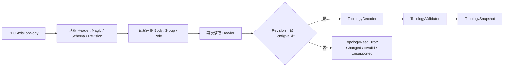
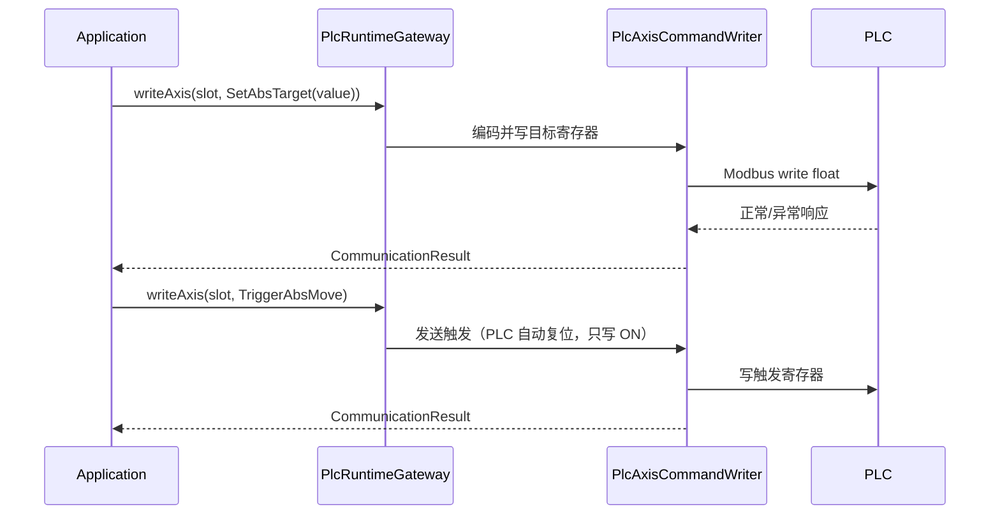

# PLC 通讯基础设施层重构设计

> 状态：重构实施前设计稿  
> 日期：2026-08-10  
> 范围：仅 `infrastructure/plc` 及其对应测试；不调整 joystick、logger、QML、presentation 和业务 Domain。  
> 目标 PLC：以 `PLC_re` 的 16 槽位拓扑、标准单轴数组、龙门请求序号/确认序号和控制许可为唯一通讯契约。

## 1. 重构目标

本次不修补旧 `ModbusSystemDriver`，而是建立一个并行的 `plc_vnext` 通讯模块。它把 Modbus 细节转换为上层能安全使用的三类能力：

1. **启动发现**：读取、确认并验证 PLC 轴拓扑。
2. **运行快照**：读取 16 个 PLC 槽位和龙门组的真实反馈，并明确数据是否可信。
3. **命令提交**：按 PLC 槽位写单轴命令，按组提交联动请求；只报告“写入是否到达 PLC”，不伪造 PLC 执行成功。

重构完成的 infrastructure 必须不知道业务上有没有 “Y 轴”“Machine_A” 或 “X1”。它只认识 `PlcAxisSlot(0..15)`、`GroupIndex(0..1)`、协议字段和通讯状态。

## 2. 当前问题与迁移原则

当前实现的关键问题：

- `ModbusSystemDriver.h` 同时承担寄存器选择、命令编码、边沿脉冲、反馈轮询、状态推导和对 `SystemContext` 的直接写入。
- `RegisterAddressAll.h` 按 `x_axis/y_axis/z_axis/r_axis` 划分；`AxisId` 的 `switch` 将旧固定六轴模型硬编码到通讯层。
- `pollFeedback(SystemContext&)` 使 infrastructure 依赖并修改 Domain，无法独立测试或并行迁移。
- 旧 `AxisStateDeriver` 以客户端多信号推导状态；新 PLC 已提供拓扑、联动状态和控制许可，不能继续形成第二个业务真相源。

迁移采用以下规则：

1. 新模块先只读、影子运行；旧 `ModbusSystemDriver` 保持正式控制路径。
2. 新旧模块不共享“固定轴寄存器选择”逻辑；只共享经过验证的 transport 和基础 `Codec`，避免旧映射渗透新设计。
3. 任何会引起物理运动的命令不允许双写。写路径按命令类别、按单轴类型逐步切换。
4. infrastructure 返回 DTO/结果，不接收 `SystemContext`、`Axis` 或 ViewModel。
5. PLC 是联动、控制许可和运行状态的最终权威；本层缓存只能保存通讯快照，不能保存业务事实。

## 3. 新目录树与文件职责

新代码统一置于 `infrastructure/plc_vnext`。旧 `infrastructure/plc` 在迁移期间保留，最后单独删除；不要在同一目录混合新旧两种模型。

```text
infrastructure/
├─ joystick/                                  # 保持原样；不在本次范围
├─ logger/                                    # 保持原样；仅可被新模块调用记录诊断
├─ utils/                                     # 保持原样；不放 PLC 业务规则
│
├─ plc/                                       # Legacy：迁移期间继续承载现网控制
│  ├─ ModbusSystemDriver.h                    # 旧综合 Driver；禁止继续增加新 16 槽位功能
│  ├─ AxisStateDeriver.h                      # 旧客户端状态推导；迁移后审查/删除
│  └─ protocol/                               # 旧固定轴寄存器模型；仅维护缺陷
│
└─ plc_vnext/                                 # New：16 槽位通讯架构
   ├─ README.md                               # 模块边界、PLC协议版本、测试与接线说明
   ├─ PlcRuntimeGateway.h                     # 对 application 暴露的唯一高层实现类
   ├─ PlcRuntimeGateway.cpp                   # 组合 readers/writers/session，不含业务决策
   │
   ├─ contracts/                              # 跨 infrastructure/application 的纯 DTO；无 Modbus/Qt
   │  ├─ PlcAxisSlot.h                        # 强类型槽位；构造时校验范围 0..15
   │  ├─ PlcGroupIndex.h                      # 强类型组号；当前范围 0..1
   │  ├─ TopologySnapshot.h                   # 原始且完整的 PLC AxisTopology 快照
   │  ├─ AxisRuntimeSnapshot.h                # 单槽位反馈 + trusted + sampledAt
   │  ├─ RuntimeSnapshot.h                    # 一次轮询得到的 16 槽位/组级快照集合
   │  ├─ GantryStatusSnapshot.h               # State/AckSeq/Result/控制许可等 PLC 输出
   │  ├─ PlcCommand.h                         # 槽位命令与组级联动请求的协议无关表达
   │  ├─ CommunicationResult.h                # 写入/读取错误、可否重试、诊断文本
   │  └─ ConnectionState.h                    # 连接状态与最后诊断信息
   │
   ├─ transport/                              # TCP/Modbus 帧与连接生命周期；不认识槽位和轴
   │  ├─ IModbusClient.h                      # 读/写 coils 和 holding registers 的窄接口
   │  ├─ AsioModbusTcpClient.h/.cpp           # 复用或迁移现有 Asio 实现
   │  ├─ ModbusRequest.h                      # 单次读写请求的值对象
   │  ├─ ModbusResponse.h                     # 单次读写响应/异常码的值对象
   │  ├─ ModbusIoExecutor.h/.cpp              # 单通道串行化 I/O；防止并发事务交叉
   │  └─ ConnectionMonitor.h/.cpp             # 断线、手动重连、退避信息；不重放运动命令
   │
   ├─ codec/                                  # 基础二进制/寄存器转换；完全无地址和业务名称
   │  ├─ EndianPolicy.h                       # REAL/DINT 的字节序、字序定义
   │  ├─ RegisterCodec.h/.cpp                 # BOOL/INT/DINT/REAL <-> 原始 word/bit
   │  ├─ RawRegisterBlock.h                   # 连续读取到的原始 word/bit 缓冲区
   │  └─ DecodeError.h                        # 长度、越界、非法枚举等解码失败
   │
   ├─ layout/                                 # PLC 协议布局；唯一允许出现 Modbus 地址公式的目录
   │  ├─ RegisterAddress.h                    # 强类型 coil / holding-register 地址
   │  ├─ AxisSlotRegisterLayout.h             # 槽位0..15的单轴参数、命令、反馈地址公式
   │  ├─ AxisTopologyLayout.h                 # AxisTopology Header/Group/Role 字段地址
   │  ├─ GantryLayout.h                       # GantryCommand/GantryStatus 的组级布局
   │  ├─ ReadPlan.h                           # 合并连续区间后的读计划
   │  └─ ReadPlanBuilder.h/.cpp               # 由 layout 生成最少的安全批量读取请求
   │
   ├─ topology/                               # 启动配置读取、解码和校验；只读
   │  ├─ PlcTopologyReader.h/.cpp             # Header -> Body -> Header 的稳定 Revision 双读
   │  ├─ TopologyDecoder.h/.cpp               # 原始寄存器块 -> TopologySnapshot
   │  ├─ TopologyValidator.h/.cpp             # 结构/语义校验，输出具体违反规则
   │  └─ TopologyReadError.h                  # 无效、版本不支持、Revision变化等失败类型
   │
   ├─ telemetry/                              # 运行时只读反馈；不注入领域对象
   │  ├─ PlcSnapshotReader.h/.cpp             # 执行 ReadPlan，生成 RuntimeSnapshot
   │  ├─ AxisSnapshotDecoder.h/.cpp           # 单槽位寄存器 -> AxisRuntimeSnapshot
   │  ├─ GantryStatusReader.h/.cpp            # 组级寄存器 -> GantryStatusSnapshot
   │  └─ SnapshotQuality.h                    # trusted/stale/partial/transport-failed 质量标志
   │
   ├─ command/                                # 协议写入；不决定“是否应该运动”
   │  ├─ PlcAxisCommandWriter.h/.cpp          # 槽位参数、目标、停止、使能、点动的编码和写入
   │  ├─ PlcGantryCommandWriter.h/.cpp        # Command 后 RequestSeq 的有序写入
   │  └─ CommandWritePolicy.h                 # 保持电平 / PLC 自复位分类（触发由 PLC 自动复位）
   │
   ├─ diagnostics/                            # 可观察性 DTO/格式化，logger 实现在外部复用
   │  ├─ PlcDiagnosticEvent.h                 # 地址、操作、耗时、错误、Revision 等结构化事件
   │  └─ PlcSnapshotFormatter.h/.cpp          # 只读诊断文本；不得承担业务判定
   │
   └─ fake/                                   # vNext 测试替身，模拟 PLC 契约而不是旧 Domain
      ├─ FakeModbusClient.h/.cpp              # 可脚本化原始寄存器和通讯故障
      ├─ FakePlcRuntimeGateway.h/.cpp         # 应用层 TDD 用的高层假实现
      └─ PlcFixtureBuilder.h                  # 构造有效/无效拓扑和槽位反馈测试夹具

tests/infrastructure/plc_vnext/
├─ transport/                                 # 帧、超时、连接、串行化测试
├─ codec/                                     # 字节序和边界测试
├─ layout/                                    # 全部16槽位和两组地址公式测试
├─ topology/                                  # 双读、Decoder、Validator、错误测试
├─ telemetry/                                 # 批量读、快照可信度、数据缺失测试
├─ command/                                   # 写入顺序、边沿、重放禁止测试
├─ integration/                               # FakeModbus 下 Gateway 端到端测试
└─ support/                                   # 测试数据、断言、fixture；不放生产代码
```

### 3.1 目录边界规则

| 目录 | 可以依赖 | 禁止依赖 |
| --- | --- | --- |
| `transport` | Asio、Modbus 帧、基础诊断 | 槽位、拓扑、轴、Domain、Qt UI |
| `codec` | 标准库、`contracts` 的基础数值类型 | 地址、网络、AxisId、业务状态 |
| `layout` | `contracts`、`codec` | Modbus client、Domain、ViewModel |
| `topology` | `layout`、`codec`、`transport` | `SystemContext`、运动命令、UI |
| `telemetry` | `layout`、`codec`、`transport` | `Axis`、领域状态推导、命令决策 |
| `command` | `layout`、`codec`、`transport` | 联动业务编排、重试策略、ViewModel |
| `PlcRuntimeGateway` | 本模块的 reader/writer/connection | `SystemContext`、`AxisId`、presentation |
| `fake` | `contracts` | 真实 TCP、旧 `FakePLC`、Domain |

## 4. 数据关系

### 4.1 启动拓扑发现



`TopologySnapshot` 只表达 PLC 原始配置和校验结果。上层以后可以把它转换为 `AxisRegistry`，但 infrastructure 不创建 Domain 对象。

### 4.2 16 槽位运行反馈


一个 `RuntimeSnapshot` 必须有：采样时间、读取耗时、连接状态、各槽位快照和质量状态。一次连续读失败时，不能将失败字段变成 0 或“正常”；应标为 `trusted=false` 或整体失败，由 application 决定是否锁定普通控制。

### 4.3 单轴命令



目标和触发永远是两次独立调用。`CommunicationResult::ok()` 仅表示 PLC 通讯已确认写入，**不表示运动已发生，也不表示 PLC 已执行并自动复位触发线圈**；触发/终止/清除线圈的"读回确认"由 Step 10/11 的 telemetry/ack reader 异步读取 `RuntimeSnapshot` 完成，命令 writer 只负责提交，不做读回。

### 4.4 联动命令

```text
Application 产生 Couple / Decouple / Reset 请求
    -> PlcGantryCommandWriter 写 Command
    -> PlcGantryCommandWriter 最后写 RequestSeq = N + 1
    -> PLC 执行状态机
    -> GantryStatusReader 读取 AckSeq / CommandResult / ControlAllowed
    -> Application 决定继续等待、成功、拒绝或超时
```

Infrastructure 不等待业务超时、不判定联动成功、不写 GearIn/GearOut、不写控制许可。这些均属于 PLC 或 application。

## 5. 关键类型与公开接口

第一步仅定义接口和 DTO，允许实现后续逐个替换。接口名称可调整，但责任不能混合。

```cpp
class IPlcRuntimeGateway {
public:
    virtual Result<TopologySnapshot> readTopology() = 0;
    virtual Result<RuntimeSnapshot> readRuntime() = 0;

    virtual CommunicationResult writeAxis(
        PlcAxisSlot slot,
        const PlcAxisCommand& command) = 0;

    virtual CommunicationResult submitGantryRequest(
        PlcGroupIndex group,
        const GantryRequest& request) = 0;

    virtual ConnectionState connectionState() const = 0;
    virtual void requestReconnect() = 0;
};
```

接口的输入输出说明：

| 类型 | 含义 | 所属边界 |
| --- | --- | --- |
| `PlcAxisSlot` | PLC 数组下标 0..15，非 X/Y/Z/R | contracts / layout |
| `TopologySnapshot` | PLC 配置快照，含有效性、版本、Revision 和角色绑定 | infrastructure 输出 |
| `RuntimeSnapshot` | PLC 运行数据及可信度，不是领域 Axis | infrastructure 输出 |
| `PlcAxisCommand` | 协议无关的单轴写入意图，含目标/触发的不同类型 | application 输入 |
| `GantryRequest` | Couple/Decouple/Reset 及请求序号意图 | application 输入 |
| `CommunicationResult` | 一次 I/O 是否成功以及通讯失败原因 | infrastructure 输出 |

## 6. 旧文件处理清单

| 当前文件 | 本阶段处理 | 最终去向/理由 |
| --- | --- | --- |
| `infrastructure/plc/ModbusSystemDriver.h` | 冻结新功能，仅作为 legacy 正式路径 | vNext 全部切换后删除；职责过多且绑定 `AxisId/SystemContext`。 |
| `infrastructure/plc/AxisStateDeriver.h` | 不复用到 vNext | 审查后删除；PLC 状态字段应优先原样读取。 |
| `protocol/RegisterAddressAll.h` | 不扩展 | 由 `layout/AxisSlotRegisterLayout.h` 等按 PLC 数组契约替代。 |
| `protocol/AsioModbusTcpClient.*` | 先复制/迁移并加测试，不改变行为 | 转入 `plc_vnext/transport` 后，旧模块可暂时适配使用。 |
| `protocol/IModbusClient.h` | 提取窄接口或迁移 | vNext transport 的唯一设备 I/O 抽象。 |
| `protocol/RegisterCodec.h`、`EndianPolicy.h` | 审计后迁移 | 进入 `codec`；必须补齐 DINT/REAL 字序测试。 |
| `protocol/PlcPoller.*` | 不直接复用业务 API | 有价值的地址合并算法迁入 `layout/ReadPlanBuilder`。 |
| `protocol/PlcDevice.h`、`MemorySnapshot.h` | 仅作过渡测试工具 | 替换为 `RawRegisterBlock`，避免注册表依赖。 |
| `protocol/RegisterRegistry.*`、validator | 不扩展 | 旧静态寄存器表模型；新版本以布局函数和 DTO 校验替代。 |
| `infrastructure/ISystemDriver.h` | 暂不改调用方 | 后续 application 迁移时由 `IPlcRuntimeGateway` 替代；新模块不得依赖它。 |
| `infrastructure/logger/*` | 不修改 | 仅接收 `PlcDiagnosticEvent`，不参与协议与业务判断。 |
| `infrastructure/joystick/*` | 不修改 | 后续 presentation/application 改为动态轴时再单独处理。 |

## 7. TDD 实施顺序

先建立 `tests/infrastructure/plc_vnext` 和独立 CMake target；测试从第一天起可执行，不依赖旧测试是否恢复。

1. `contracts`：槽位、组号、结果类型的边界和值语义测试。
2. `codec`：`BOOL/INT/DINT/REAL` 编解码、字节序、截断和越界测试。
3. `layout`：16 槽位全部地址公式、相邻字段不重叠、两组联动地址测试。
4. `topology`：有效拓扑、无效角色、重复槽位、版本不匹配、Revision 两次读取变化测试。
5. `telemetry`：连续区间合并、完整快照、部分失败、不可信/过期快照测试。
6. `command`：目标/触发分离、写入顺序、自复位只写 ON、断线后不重放测试。
7. `PlcRuntimeGateway`：FakeModbus 端到端测试；仍不连接 `SystemContext`。
8. 真实 PLC 只读验收：先拓扑、再运行快照、最后再引入单项写入验收。

## 8. 里程碑与完成条件

| 里程碑 | 交付物 | 允许变化 | 明确禁止 |
| --- | --- | --- | --- |
| M1 协议基础 | `contracts/codec/layout` 与单元测试 | 新目录、新 CMake target | 改旧控制路径 |
| M2 启动发现 | `topology` reader/validator + Fake PLC | 只读诊断输出 | UI 按新拓扑创建轴 |
| M3 影子反馈 | `telemetry` + 新旧比较日志 | 只读轮询 | 用新快照控制运动 |
| M4 单轴写入 | `command` writer + PLC 验收 | 一个命令类别的受控切换 | 双写运动触发 |
| M5 联动通讯 | 组请求写入与状态读取 | 仅请求/确认通路 | 上位机直接控齿轮/许可 |
| M6 上层迁移 | application/domain/presentation 独立规划 | 使用 Gateway 输出 | 在本基础设施任务中顺带重写 UI |

## 9. 本文档的首个编码任务

第一个实现 PR 只创建以下文件和测试，不接真实 PLC，不产生任何写操作：

```text
infrastructure/plc_vnext/contracts/PlcAxisSlot.h
infrastructure/plc_vnext/contracts/PlcGroupIndex.h
infrastructure/plc_vnext/contracts/CommunicationResult.h
infrastructure/plc_vnext/layout/RegisterAddress.h
infrastructure/plc_vnext/layout/AxisSlotRegisterLayout.h
tests/infrastructure/plc_vnext/contracts/test_plc_axis_slot.cpp
tests/infrastructure/plc_vnext/layout/test_axis_slot_register_layout.cpp
```

在开始编码前，必须从 `PLC_re` 输出一份最终的 Modbus 地址表，确认：地址基准、每个数组的基址与步长、`REAL` 字序、拓扑/联动结构的字段地址，以及线圈触发是否需要本机产生 ON/OFF 脉冲。未确认的字段只能建为待定，不得以旧 `RegisterAddressAll.h` 的地址猜测填充。
