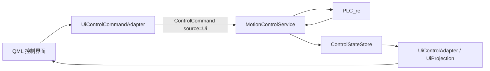

# UI 新链路控制验证实施清单（AxisTopology 驱动）

## 1. 目标与当前结论

目标是在 **Unified 模式** 下，让 UI 通过 `MotionControlService` 控制 PLC，并以同一服务发布的快照回显状态、参数和操作结果。

当前不能直接用旧 UI 验证新链路：Unified 模式中旧 `QtAxisViewModel` 已按设计不构造，`UiControlAdapter` 目前只读。因此，**还需完成 UI 命令适配、QML 控制面板迁移**。

**Phase 7 状态（龙门生命周期）**：已实现**基础生命周期闭环** —— 建立/解除走 `GantryMotionApi` + `gantry:A:0` 资源租约，`Ready` 亦视为 couple 成功终态避免租约永久占用；**取消安全收口（P0-B）已实现**：Couple 提交前取消即立即终止、绝不再发 Couple/使能写，提交后（WaitCoupleFinal）转只读观察、保持租约直到 AckSeq 自然收口为 Cancelled。

**但逻辑 X / slot 13 的 UI 放开仍依赖『真实 GantryParam 注入』（P0-A）**：Unified 组合根尚未从 PLC D1600 `GantryParam` 读取/解码/校验并在成功 boot / Revision 变化后注入 service；该 D1600 C++ 读路径（`readGantryParam` + decoder + 读计划 + gateway）未落地。读取失败或 `valid=false` 时 UI 必须禁用「建立联动」。P0-A 完成前，逻辑 X UI 不放开。

首轮 UI 真机范围应严格限定为：

| 范围 | 是否可作为首轮 UI 验证对象 |
|---|---|
| A 组 Y / slot 2 | 是 |
| A 组 Z / slot 3 | 是 |
| 其他已启用的独立角色 | 拓扑显示为 `bound + hmiVisible` 后，逐轴放开 |
| A 组 X1 / slot 0、X2 / slot 1 | 否；成员轴，不作为独立轴 UI 运动入口 |
| A 组逻辑 X / slot 13 | 否；须先完成龙门生命周期 Phase 7 |
| B 组 | 暂不放开；保留拓扑驱动能力，禁止硬编码删除 |

## 2. 必须坚持的边界

- UI 不得持有 PLC 地址、`SystemManagerVnext`、`AxisMotionApi` 或 `GantryMotionApi`。
- UI 所有写操作只能调用 `MotionControlService::submit()`；写成功不等于 PLC 已执行，必须看 `operationId` 的最终状态与反馈快照。
- Unified 模式不得恢复旧 `QtAxisViewModel` 的直写能力，也不得同时构造旧 PLC client。
- 轴选择以 `group + role` 为业务键，`slot` 仅来自 `AxisTopology` 快照用于展示和诊断；禁止把 slot 2/3、slot 13 写死在 UI 逻辑中。
- 普通操作受连接、可信度、全局锁定和急停保护；`停止`、`急停`、`急停解除`不能被普通按钮的锁定规则误禁用。
- 断线、急停、Revision 变化后不得自动重放此前的 UI 操作。

## 3. 需要完成的重构与迁移清单

### 3.1 新增 UI 写入适配器（P0）

新增 `presentation/viewmodel/UiControlCommandAdapter.{h,cpp}`，作为 UI 唯一可写入口。它持有 `MotionControlService*`，仅负责把 UI 意图转换为 `ControlCommand{source=Ui}` 并返回 `operationId`。

建议提供的 `Q_INVOKABLE` 能力：

| UI 意图 | 对应 `ControlAction` | 约束 |
|---|---|---|
| 设置手动/定位速度 | `SetManualSpeed` / `SetPositioningSpeed` | 速度必须 `> 0` |
| 设置绝对/相对预置值 | `SetAbsTarget` / `SetRelTarget` | 仅预置，不启动运动 |
| 相对清零 | `SetRelZero` | 必须由服务回报结果 |
| 轴控、电机使能 | `EnableAxisControl` / `EnableMotor` | 用 UI 开关值表达 ON/OFF |
| 开始正/反点动、停止点动 | `StartJogForward` / `StartJogBackward` / `StopJog` | 按住/松开成对提交 |
| 绝对/相对定位 | `StartAbsMove` / `StartRelMove` | `target + speed` 必须原子携带，速度 `>0` |
| 停止运动 | `StopMotion` | 始终允许提交 |
| 软件急停、解除急停 | `TriggerEmergencyStop` / `RequestEmergencyStopRelease` | 始终经服务，不直接写 M224/M225 |

适配器可做输入校验（空目标、非正速度、服务未注入），但 `MotionControlService` 仍是最终权威校验点。适配器不得绕过租约、会话或全局锁定。

### 3.2 迁移 QML 控制面板（P0）

将现有动作按钮、参数编辑和轴选择，从旧 `QtAxisViewModel` 调用迁移到：

- 读取：`UiControlAdapter` 的快照投影；
- 写入：`UiControlCommandAdapter`；
- 操作状态：显示最近的 `operationId`、`Queued/Accepted/Running/…`、`diagnostic`；
- 轴列表：由 `axes` 中的 `bound && hmiVisible` 动态生成，而不是按固定电机号创建。

普通动作按钮的可用条件至少为：

`connected && safetyTrusted && !emergencyStop && !globallyLocked && bound && trusted && hmiVisible`

其中“已租约”应显示所有者并禁用冲突启动命令。停止、软件急停和解除急停使用独立规则，不能因普通锁定而不可点击。

建议先新增 vnext 专用控制块，而不是在首轮同时大改所有旧 QML 控件；完成真机验收后再替换旧入口。

### 3.3 参数与反馈闭环（P0）

- 参数编辑框提交 `Set*` 命令后，先显示操作进行中；以 PLC 反馈快照回显最终速度、目标/相对零点，不以点击成功作为已生效。
- 定位必须从同一轴快照取得有效 `positioningSpeed`，并将目标和值一并放入 `MotionRequest`。
- UI 对 `speed <= 0`、轴不可信、未绑定、未显示的情况不提交定位请求；服务层继续保留零速度拒绝。
- UI 应明确区分“预置目标”和“开始定位”，避免编辑值时意外运动。

### 3.4 AxisTopology 驱动的选择与显示（P0）

新增或迁移 UI 选择模型，使其只保存 `group/role`，每次快照刷新后重新解析：

- 展示 `groupLetter`、角色、`slot`、可见性、绑定和可信状态；
- 拓扑 Revision 改变、角色解绑或不可见时，取消当前选择并禁止继续提交旧目标；
- 不把 A 组写死为唯一组；首轮只是通过配置/发布策略只展示 A 组可验证角色；
- X1/X2 标为“龙门成员轴”，不提供独立运动按钮；逻辑 X 在龙门未就绪时只读展示。

### 3.5 Unified 组合根接线（P0）

在 `main.cpp` 的 `kUnifiedLoopEnabled=true` 分支中：

1. 构造 `MotionControlService`；
2. 将该 service 同时注入 `UiControlAdapter` 和新增 `UiControlCommandAdapter`；
3. 将新适配器作为 QML context property 暴露；
4. QTimer 保持唯一顺序：`UDP server tick（若启用）→ service.tick() → UI refresh()`；
5. Unified 分支不构造旧 client、旧 manager、旧 `QtAxisViewModel`，旧控制 QML 只显示禁用或替换后的 vnext 控件。

首轮“仅 UI 验证”建议 Unified 模式下关闭 vnext UDP server，避免引入第二个操作来源；摇杆也先不操作同一轴。

## 4. 逻辑 X（slot 13）与龙门：必须单独完成的前置

**Phase 7 基础生命周期已实现**（`MotionControlService` 仲裁/执行打开 `GantryEnableAndCouple` / `GantryDecoupleAndDisable`，`Ready` 视为 couple 成功终态并释放 `gantry:A:0` 租约；取消安全收口 P0-B 已落地）。因此基础建立/解除可经探针验证。

**但逻辑 X UI 放开仍依赖『真实 GantryParam 注入』（P0-A）**，在完成前**不能从 UI 放开逻辑 X / slot 13 的使能、参数或运动**：

- P0-A：Unified 组合根必须从 PLC D1600 `GantryParam` 读取/解码/校验，并在每次成功 boot / Topology Revision 变化后调用 `service.applyGantryConfig(g, cfg)` 注入；读取失败或 `valid=false` 时 UI 必须禁用「建立联动」。当前 D1600 C++ 读路径（`readGantryParam` + decoder + 读计划 + `IPlcRuntimeGateway`）未落地。
- P0-B（已实现）：生命周期取消安全收口 —— Couple 提交前取消立即终止且绝不再发 Couple/使能写；提交后（WaitCoupleFinal）只读观察、保持租约直到 AckSeq 收口为 Cancelled；急停/断线期间不推进会产生新 PLC 写的步骤。

启用前还须满足以下闭环：

1. 建立前检查急停、拓扑、反馈可信、组就绪、成员状态与现有故障；若 `CommandErrorCode != 0`，先 Reset，并以本次 `RequestSeq` 对应的 `AckSeq` 和完整复位状态确认；
2. 建立：使能逻辑轴控/电机，提交 Couple 并等待 `AckSeq==RequestSeq`、`State==3`、`InternalStep==80`、`LogicalControlAllowed=ON`、`MemberControlAllowed=OFF`、无错误；
3. 仅在上述 `GantryReady` 条件持续成立时，UI 才显示/启用逻辑 X 的参数和运动；其资源必须与 X、X1、X2 整体互斥；
4. 解除：先停止逻辑 X 会话，提交 Decouple 并等待 `CommandErrorCode==0`、`InternalStep==10`、`LogicalControlAllowed=OFF`、`MemberControlAllowed=ON`，再关闭逻辑轴电机；
5. 急停、断线、超时、Revision 变化时必须有可验证的生命周期取消/收口策略，绝不在恢复通信后继续或重放龙门命令。

UI 应展示龙门 `State/InternalStep/AckSeq/CommandResult/CommandErrorCode/LogicalControlAllowed/MemberControlAllowed`，并把建立、解除作为独立 operation 跟踪，而非假装为单轴使能。

## 5. 建议实施顺序与验收

| 步骤 | 交付 | 通过标准 |
|---|---|---|
| UI-1 | `UiControlCommandAdapter` + 单测 | 正确生成 `source=Ui` 命令；无 service/非法速度不提交；急停/停止可提交 |
| UI-2 | vnext QML 单轴面板 | 动态显示 topology 轴；参数、使能、点动、定位均只经适配器提交；展示 operation 状态 |
| UI-3 | Unified 组合根接线 | 仅构造 vnext 栈；旧 UI 无写入口；单 QTimer 驱动 service 与刷新 |
| UI-4 | A.Y / A.Z 真机验收 | 下列单轴用例全部通过，留存 operationId、PLC 监视与快照日志 |
| UI-5 | Phase 7 龙门生命周期 | 建立/解除/急停/断线闭环通过（基础 + 取消安全收口 P0-B 已实现）；**补 P0-A 真实 `GantryParam` 注入**后，才开放逻辑 X / slot 13 |
| UI-6 | B 组扩展 | 由新 topology 配置驱动展示与控制，不修改 UI 地址映射 |

### A.Y / A.Z 首轮真机用例

1. Unified 模式启动，确认 UI 快照的 group/role/slot 与 PLC `AxisTopology` 一致，且 Y→slot 2、Z→slot 3；
2. 设置手动速度、定位速度、绝对/相对预置值，确认操作最终成功且 PLC 反馈回显一致；
3. 使能轴控与电机，确认操作状态和 PLC 反馈一致；
4. 低速短时点动：按住期间心跳持续、松开后方向线圈关闭并停止；
5. 小位移相对、绝对定位：目标和速度来自同一 `MotionRequest`，以位置/状态反馈确认完成；
6. 运动中执行 Stop，确认只停止目标会话；
7. 触发软件急停，确认普通 UI 操作被拒绝；解除后确认 M224/M225 自动复位、轴不自动恢复使能或运动，必须重新下发命令；
8. 断线后确认会话取消、UI 锁定；恢复通信后不重放原运动。

## 6. 建议修改的文件清单

| 文件 | 动作 |
|---|---|
| `presentation/viewmodel/UiControlCommandAdapter.h/.cpp` | 新增 UI→`ControlCommand` 写入适配器（✅ 已实现，含 UI-1 单测） |
| `presentation/qml/blocks/` 下的控制块、`presentation/qml/Main.qml` | 用快照读取 + command adapter 写入，移除旧 VM 直写绑定 |
| `presentation/CMakeLists.txt` | 纳入新适配器（✅ 已实现） |
| `presentation/tests/test_ui_control_command_adapter.cpp` | 新增适配器、QML 可用性与 operation 回显测试（✅ 已实现） |
| `main.cpp` | Unified 分支注入新适配器；保持 Legacy/Unified 二选一（✅ 已注入 `controlCommand` context property；P0-A 龙门 `GantryParam` 注入为待接线占位） |
| `application_vnext/control/*` 与对应测试 | 仅在 UI 发现缺失动作、状态投影或 Phase 7 龙门闭环时补充；不把 UI 逻辑下沉到 PLC 访问层（✅ Phase 7 基础生命周期 + P0-B 取消安全收口已实现） |

## 7. 签收口径

在 UI-4 完成前，只能称为“Unified 架构与 UI 只读投影已就绪”，不能称为“UI 已迁移”。

完成 UI-4 后，可签收：**基于 AxisTopology 的独立单轴（首轮 A.Y/A.Z）UI 控制链路**。逻辑 X / slot 13 仍是未签收项，必须在 Phase 7 龙门建立、解除、异常取消和现场闭环证据完成后单独签收。
